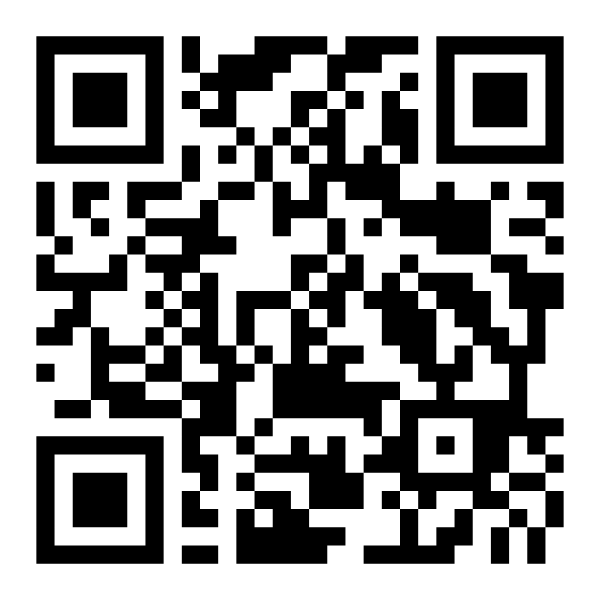

```{r}
#| context: setup
#| include: false

library(tidyverse)
library(knitr)
library(kableExtra)


scan_table <- function(N = 20) {
  obs_table_1 <- tibble(
  Scan         = 1:N,
  `Behavior`   = c(" ")
)
}

chi_total <- function() {
  tibble(
    Code                      = "Sum (\u03C7\u00B2)",
    `Expected (e)`            = "-", 
    `Observed (o)`            = "-",
    `Deviation ($d = o - e$)` = "-",
    "$d\u00B2$"               = "-",
    "$d\u00B2/e$"             = " "
  )
}

chi_table <- function(obs_table) {
  obs_table %>%
  mutate(
    `Expected (e)`            = " ", 
    `Observed (o)`            = " ",
    `Deviation ($d = o - e$)` = " ",
    "$d\u00B2$"                 = " ",
    "$d\u00B2/e$"               = " "
  ) %>%
    bind_rows(chi_total())
}


obs_kable <- function(obs_table) {
  kable(
  obs_table, 
  format = "latex"
  )
}

summary_kable <- function(summary_table) {
  kable(
  summary_table, 
  format = "latex"
  )
}
```


# Learning Objectives

By the end of this exercise you should be able to:

- Develop a testable behavioral hypothesis.
- Use a standardized ethogram to classify animal behavior.
- Evaluate inter-observer reliability.
- Compare scan sampling and all-occurrence sampling.
- Use a chi-square test to evaluate behavioral data.
- Interpret how sampling method influences scientific conclusions.

## Video Feed Choices

San Diego Zoo
: [https://zoo.sandiegozoo.org/live-cameras](https://zoo.sandiegozoo.org/live-cameras)
: {width=10%}

Lincoln Park Zoo
: [https://www.lpzoo.org/live-cams/](https://www.lpzoo.org/live-cams/)
: {width=10%}

Smithsonian National Zoo
: [https://nationalzoo.si.edu/webcams](https://nationalzoo.si.edu/webcams)
: {width=10%}

Explore.org Live Feeds
: [https://explore.org/livecams/currently-live](https://explore.org/livecams/currently-live)
: {width=10%}


# Background
Behavior is one of the most visible ways that animals interact with their environment. Because behavior changes continuously, biologists use standardized observation methods to collect objective and repeatable data.

An **ethogram** is a list of clearly defined behaviors used to classify observations. Before collecting behavioral data, researchers often compare observations between multiple observers to ensure that everyone is recording behaviors consistently.

In this exercise you will:

1. Practice using a standardized ethogram.
2. Measure inter-observer reliability.
3. Test a behavioral hypothesis using scan sampling.
4. Compare scan sampling with all-occurrence sampling.
5. Interpret how different sampling methods influence scientific conclusions.



# Part I – Standardized Ethogram

Use the following ethogram throughout this exercise.

```{r}
ethogram <- tibble(
  Code = c(
    "RST",
    "MVE",
    "FED",
    "GRM",
    "SOC",
    "EXP",
    "OTH",
    "OTS"
  ),
  Behavior = c(
    "Resting",
    "Locomotion",
    "Feeding",
    "Grooming",
    "Social Interaction",
    "Exploration",
    "Other",
    "Out of Sight"
  ),
  Definition = c(
    "Sitting, lying, or standing with little movement",
    "Walking, running, climbing, swimming, or flying",
    "Searching for, manipulating, or consuming food",
    "Self-maintenance such as grooming, scratching, or preening",
    "Direct interaction with another individual",
    "Investigating the environment or objects",
    "Behavior not fitting another category",
    "Animal cannot be observed"
  )
)

generic <- tibble(
  Code = c("1", "2"),
  Behavior = c(" ")
)

summary_kable(ethogram)
```



# Part II – Inter-Observer Reliability

- [ ] Working with your partner, watch the same animal for approximately **10 minutes**.
- [ ] Every **30 seconds**, independently record the behavior occurring at that instant.

:::{.callout-important}
Do **not** discuss observations while collecting data.
:::

## Observation Table

```{r}
#| echo: false

obs_table_1 <- scan_table() %>%
  mutate(`Your Record` = Behavior, `Partner Record` = Behavior, `Agreement?` = Behavior, .keep = "unused")


obs_kable(obs_table_1)
```


### Calculate Observer Agreement

```{r}
#| echo: false

obs_table_2 <- tibble(
  `N Scans`      = c(20),
  `N Agreements` = c(" "),
  `Percent Agreement` = c(" ")
)

obs_kable(obs_table_2)
```

### Questions

1. Was your observer agreement above 85%?
\bigskip

2. Which behaviors produced the most disagreement?
\bigskip

3. How could the ethogram be improved?
\bigskip




# Part III – Develop a Hypothesis

For this exercise, your hypothesis should compare **two behavioral categories**.

:::{.callout-note}
For the purpose of simplicity, we are really treating specific predictions like hypotheses today. A better hypothesis for each would be a broader biological statement about the relationship between two or more variables that we could support or refute using a number of more specific tests/predictions.
:::

1. Fill out the null hypothesis implied by each of those below and take a moment to consider which behaviors from the ethogram you would fold into each category.
2. Select one of these 3 hypotheses to test.

### Active vs. Inactive

>**Ha**: *The animal spends more time active than inactive or the animal spends more time inactive than active.*
>**H0:**
>

### Feeding vs. Not Feeding

>**Ha**: *The animal spends most of its time feeding or the animal spends most of its time not feeding.*
>**H0:**
>

### Social vs. Solitary

>**Ha**: *The animal spends most of its time socializing or it spends most of its time not socializing.*
>**H0:**
>


### State your hypotheses

#### Null hypothesis (H₀):

\bigskip


#### Alternative hypothesis (Hₐ):

\bigskip




# Part IV – Scan Sampling


:::{.callout title="Protocol"}

You will observe one animal on your live animal camera for **15 minutes** and record which behavior the individual is engaged in every **30 seconds**, yielding a total **sample size of 20 scans**.

*Note: You only need one observer per group for this.*

:::

- [ ] Before you begin, fill out the observation table below with your expected frequencies.
  - *Given the hypothesis you chose, how many of the 20 scans do you expect to record each of the following behaviors?*


- [ ] Complete your 15-minute observation.

```{r}
obs_table_3 <- scan_table()


obs_kable(obs_table_3)
```


- [ ] For each behavior, calculate the deviation (*d*) between observed (*o*) and expected (*e*) scan frequencies and square the result.

$$ d = (o - e)^2 $$

```{r}
obs_table_4 <- generic %>%
  chi_table()

obs_kable(obs_table_4)
```



:::{.callout title="Result"}

\medskip

**\u03C7\u00B2:** ____
\medskip

$df = 1$
\medskip

**p-value:**_____________________
\smallskip

**Decision:**

- [ ] Reject H₀
- [ ] Fail to reject H₀

:::


# Part V – Questions

1. What was your dependent variable? (0.5 pts)
\bigskip

2. What was your independent variable? (0.5 pts)
\bigskip

3. What is your sample size? (0.25 pts)
\bigskip

4. Did your experiments have replication of treatments? (0.25 pts)
\bigskip


