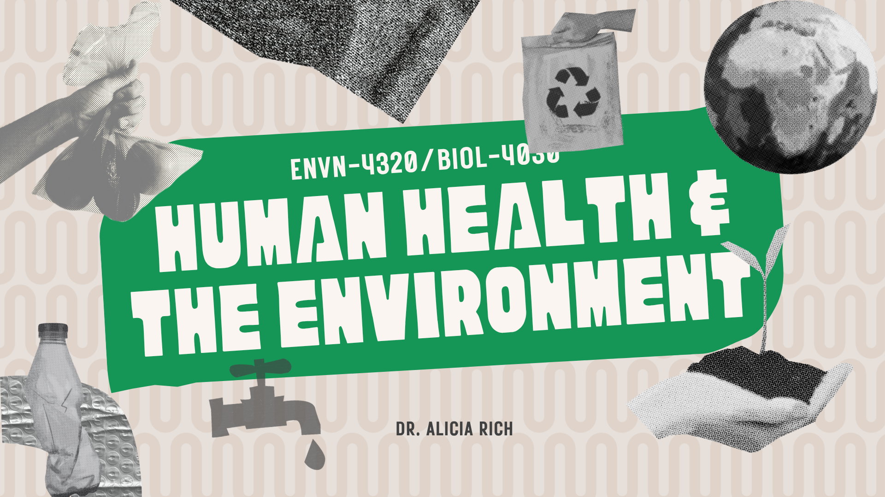

On this site you can find the most up to date syllabi and schedules for any courses I am currently teaching at UNO. Please check back often, as I will update the schedules as needed.[^1]

## Course Docs

:::{#accordionLinks .accordion}

::::{.accordion-item}

::::{#headingSyllabus .accordion-header}

::::{.accordion-button type="button" data-bs-toggle="collapse" data-bs-target="#collapseSyllabus" aria-expanded="true" aria-controls="collapseSyllabus"}

### Syllabi

::::

::::

::::{#collapseSyllabus .accordion .collapse .hide aria-labelledby="headingSyllabus" data-bs-parent="#accordionLinks"}

:::{layout-ncol=2}

:::

::::

::::

::::{.accordion-item}

::::{#headingSched .accordion-header}

::::{.accordion-button type="button" data-bs-toggle="collapse" data-bs-target="#collapseSched" aria-expanded="true" aria-controls="collapseSched"}

### Schedules

::::

::::

::::{#collapseSched .accordion .collapse .hide aria-labelledby="headingSched" data-bs-parent="#accordionLinks"}

:::{layout-ncol=2}

:::

::::

::::

:::

## Recent Updates

:::{#accordionListing .accordion}

::::{.accordion-item}

::::{#headingOne .accordion-header}

::::{.accordion-button type="button" data-bs-toggle="collapse" data-bs-target="#collapseOne" aria-expanded="true" aria-controls="collapseOne"}

#### Conservation Biology

::::

::::

::::{#collapseOne .accordion .collapse .hide aria-labelledby="headingOne" data-bs-parent="#accordionListing"}

::: {#conbio-updates}

:::

::::

::::

::::{.accordion-item}

::::{#headingTwo .accordion-header}

::::{.accordion-button type="button" data-bs-toggle="collapse" data-bs-target="#collapseTwo" aria-expanded="true" aria-controls="collapseTwo"}

#### Human Health & the Environment

::::

::::

::::{#collapseTwo .accordion .collapse .hide aria-labelledby="headingTwo" data-bs-parent="#accordionListing"}

::: {#hhe-updates}

:::

::::

::::

:::

[^1]: The information here is also available through the canvas course page. All information should update to canvas in real time, as these pages are embedded as direct links there.