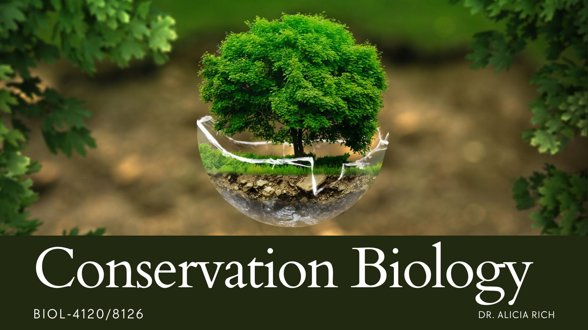

On this site you can find the most up to date syllabi and schedules for any courses I am currently teaching at UNO. Please check back often, as I will update the schedules as needed.[^1]

## Current Courses

::: {layout-ncol=2}

:::

## Syllabi and Schedules

::: {#main-index}

:::

## Slide Decks

### Conservation Biology

::: {#conbio-slides}

:::

### Human Health & the Environment

::: {#hhe-slides}

:::

[^1]: The information here is also available through the canvas course page. All information should update to canvas in real time, as these pages are embedded as direct links there.