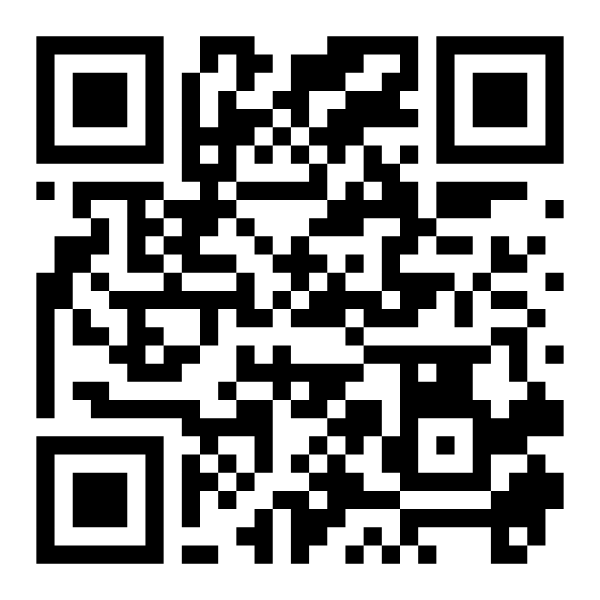
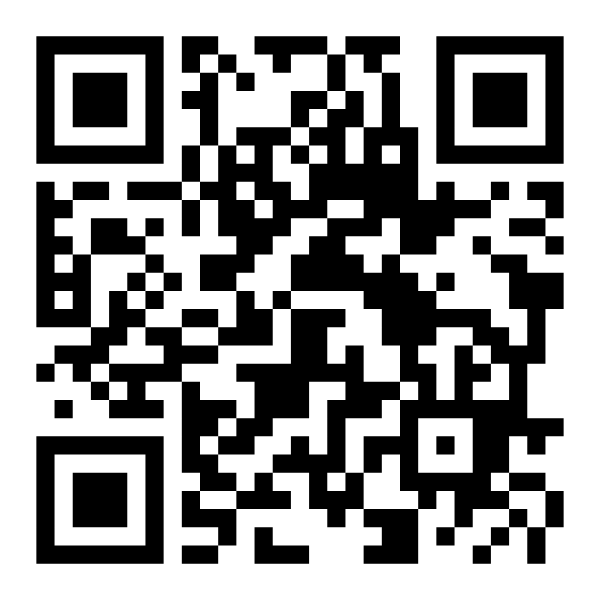
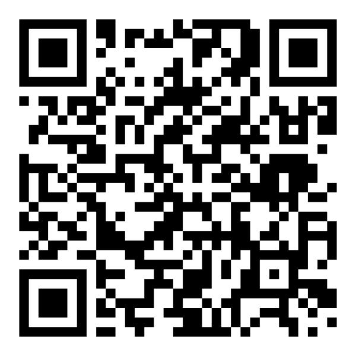

### Learning goals

By the end of this lab you should be able to:

* Use an **ethogram** to record animal behavior with **operational definitions**.
* Collect data using **scan sampling**.
* Write a clear **null and alternative hypothesis** about behavior.
* Use a **chi-square test** to evaluate your hypothesis.

## Part 1 (in lab): Mystery box

(Complete the mystery box activity as instructed.)

## Part 2: Observing animal behavior (webcam)

### Materials

* Live animal webcam/video
* This handout
* Timer (phone timer is fine)
* Data table (below)

#### Video Feed Choices

San Diego Zoo
: [https://zoo.sandiegozoo.org/live-cameras](https://zoo.sandiegozoo.org/live-cameras)
: {width=10%}

Lincoln Park Zoo
: [https://www.lpzoo.org/live-cams/](https://www.lpzoo.org/live-cams/)
: {width=10%}

Smithsonian National Zoo
: [https://nationalzoo.si.edu/webcams](https://nationalzoo.si.edu/webcams)
: {width=10%}

Explore.org Live Feeds
: [https://explore.org/livecams/currently-live](https://explore.org/livecams/currently-live)
: {width=10%}

### Important observation rules

* Score only what you can **see**, not what you think the animal “means.”
* If the animal is partly hidden and you **cannot determine the behavior**, use:

  * **Behavior Obscured** (you know where it is, behavior unclear)
  * **Animal Not Visible** (you can’t see it at all)

## Step A — Choose a focal animal and a “comparison”

You will test a question using **two conditions**. Choose ONE comparison:

**Option 1 (recommended): Time comparison**

* Condition A: first 10 minutes of observation
* Condition B: second 10 minutes of observation

**Option 2: Two animals**

* Animal A vs Animal B (only if both are visible reliably)

**Option 3: Two exhibit zones**

* Zone A vs Zone B (only if the exhibit is clearly divided and you can tell zones)

### Write your choice here:

Comparison type:
: ___________________________

Condition A:
: _______________________________

Condition B:
: _______________________________

## Step B — Pick 5 behavior categories (simplify the ethogram)

The full ethogram is extensive. For this lab, you will collapse behaviors into **5 simple categories** so your chi-square test stays clean.

Use these categories (circle the exact codes you will use):

1. **Inactive** (Inactive / Standing / Sitting / Lying / Floating / Vertical clinging / Hanging)
2. **Feeding/Foraging/Drinking** (Feeding/Foraging/Drinking + all foraging subtypes + Feeding/Drinking/Ruminating/Nursing)
3. **Locomotion** (Walking/Running/Climbing/Leaping/Swimming/Flying/etc.)
4. **Other (Solitary)** (Exploration, self-maintenance, scent marking, solitary play, elimination, vocalization, etc.)
5. **Social** (Affiliative + Reproductive + Agonistic)
6. **Undesirable** (Pacing, stereotypies, self-injury, etc.) — include only if you see it
7. **Not Visible** (Behavior Obscured + Animal Not Visible)

**Your required categories:** choose **exactly 5**, and one MUST be **Not Visible**.
Write your 5 categories here:

1. ---
2. ---
3. ---
4. ---
5. ---

*Tip:* If you never see “Undesirable” or “Social,” don’t include them. Pick categories you expect to observe at least sometimes.

## Step C — Collect data using scan sampling

You will do **20 scans total** (10 scans per condition).

* Set a timer for **1-minute intervals**
* At each minute mark, record the **single best behavior category** that describes what the animal is doing **at that instant**
* If more than one behavior occurs, score the behavior that is **most dominant** at the instant of the scan
* If you cannot determine behavior, score **Not Visible** (Obscured or Not Visible)

### Scan sheet

Fill in one row per scan.

| Scan # | Condition (A or B) | Behavior category (one of your 5) | Notes (optional) |
| -----: | :----------------: | --------------------------------- | ---------------- |
|      1 |          A         |                                   |                  |
|      2 |          A         |                                   |                  |
|      3 |          A         |                                   |                  |
|      4 |          A         |                                   |                  |
|      5 |          A         |                                   |                  |
|      6 |          A         |                                   |                  |
|      7 |          A         |                                   |                  |
|      8 |          A         |                                   |                  |
|      9 |          A         |                                   |                  |
|     10 |          A         |                                   |                  |
|     11 |          B         |                                   |                  |
|     12 |          B         |                                   |                  |
|     13 |          B         |                                   |                  |
|     14 |          B         |                                   |                  |
|     15 |          B         |                                   |                  |
|     16 |          B         |                                   |                  |
|     17 |          B         |                                   |                  |
|     18 |          B         |                                   |                  |
|     19 |          B         |                                   |                  |
|     20 |          B         |                                   |                  |

## Step D — Convert your scans into a summary count table

Count how many times each category occurred in each condition.

### Observed counts (O)

| Behavior category (your 5) | Condition A (count) | Condition B (count) | Row total |
| -------------------------- | ------------------: | ------------------: | --------: |
| Category 1                 |                     |                     |           |
| Category 2                 |                     |                     |           |
| Category 3                 |                     |                     |           |
| Category 4                 |                     |                     |           |
| Category 5                 |                     |                     |           |
| **Column totals**          |              **10** |              **10** |    **20** |

(If your totals aren’t 10 and 10, you missed scans—fix before continuing.)

## Part 3: Hypotheses (chi-square test of independence)

### Your research question (one sentence)

Example formats:

* “Does the distribution of behaviors differ between Condition A and Condition B?”
* “Does Animal A show a different behavior profile than Animal B?”

**Question:**

### Null hypothesis (H0)

For a chi-square test of independence:

**H0:** The proportion of scans in each behavior category is the **same** in Condition A and Condition B.

Write it in your own words:

---

### Alternative hypothesis (HA)

**HA:** The distribution of behaviors is **different** between Condition A and Condition B.

Write it in your own words:

---

---

## Step E — Calculate expected counts (E)

For each cell:

$$
E = \frac{(\text{row total})(\text{column total})}{\text{grand total}}
$$

Because each column total is 10 and grand total is 20:

$$
E = \frac{(\text{row total})(10)}{20} = \frac{\text{row total}}{2}
$$

So for each behavior category, the expected count in Condition A equals **half of the row total**, and same for Condition B.

### Expected counts (E)

| Behavior category | Row total | Expected in A (E) | Expected in B (E) |
| ----------------- | --------: | ----------------: | ----------------: |
| Category 1        |           |                   |                   |
| Category 2        |           |                   |                   |
| Category 3        |           |                   |                   |
| Category 4        |           |                   |                   |
| Category 5        |           |                   |                   |

## Step F — Compute chi-square

For each cell:

$$
\chi^2 = \sum \frac{(O-E)^2}{E}
$$

### Chi-square work table

Fill in all 10 cells (5 categories × 2 conditions).

| Behavior category | O (A) | E (A) | (O−E) | (O−E)²/E | O (B) | E (B) | (O−E) | (O−E)²/E |
| ----------------- | ----: | ----: | ----: | -------: | ----: | ----: | ----: | -------: |
| Category 1        |       |       |       |          |       |       |       |          |
| Category 2        |       |       |       |          |       |       |       |          |
| Category 3        |       |       |       |          |       |       |       |          |
| Category 4        |       |       |       |          |       |       |       |          |
| Category 5        |       |       |       |          |       |       |       |          |
| **Totals**        |       |       |       | **chi² =** |       |       |       |          |

## Step G — Degrees of freedom and decision

Degrees of freedom for chi-square test of independence:

$$
df = (r-1)(c-1)
$$

Here, (r=5) behavior categories and (c=2) conditions, so:

$$
df = (5-1)(2-1)=4
$$

* Use your course method (table or calculator/software) to find the **p-value** for your χ² with df = 4.
* Use (\alpha = 0.05) unless your instructor tells you otherwise.

chi-square value:
: ____________

df:
: 4

p-value:
: ____________

Decision:
: - []  Reject H0
: - []  Fail to reject H0

### Interpretation (2–4 sentences)

* What does your result mean in plain language?
* Which behaviors contributed most to χ² (largest (O−E)²/E values)?

---

---

---

## Data quality checks (answer briefly)

1. Did you have any categories with expected counts **less than 5**?

- []  No
- []  Yes
   - If yes, combine two similar categories and re-run the test.

2. Were there many **Not Visible** scans?

- []  No
- []  Yes
  - Briefly explain why (camera angle, animal location, exhibit complexity, etc.).

3. One limitation of your observational design:

---

---

## Submission checklist

Turn in:

* Completed scan sheet
* Observed count table (O)
* Expected count table (E)
* Chi-square work table with χ², df, p-value
* Short interpretation + data quality checks