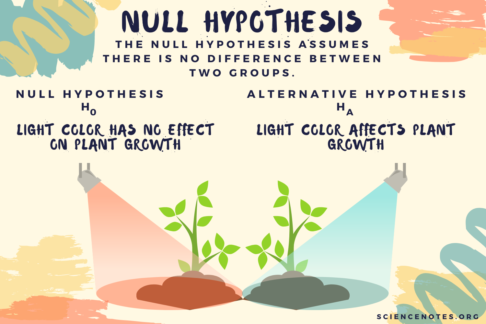
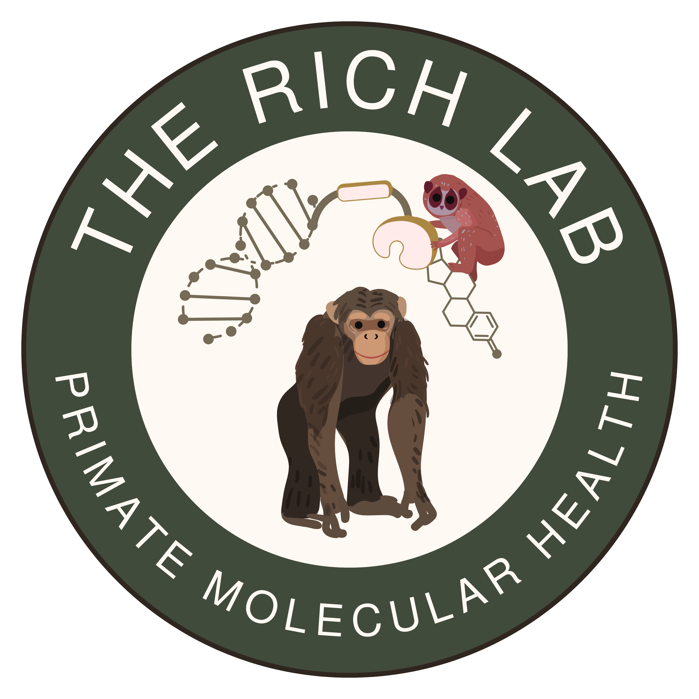
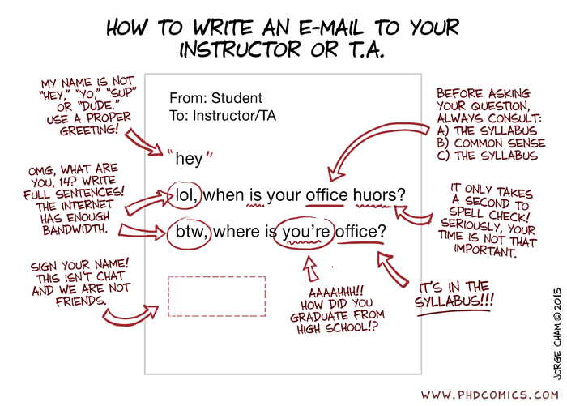
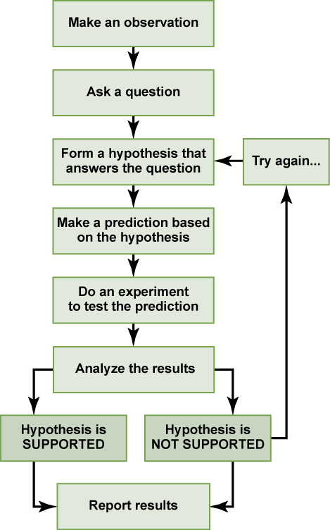
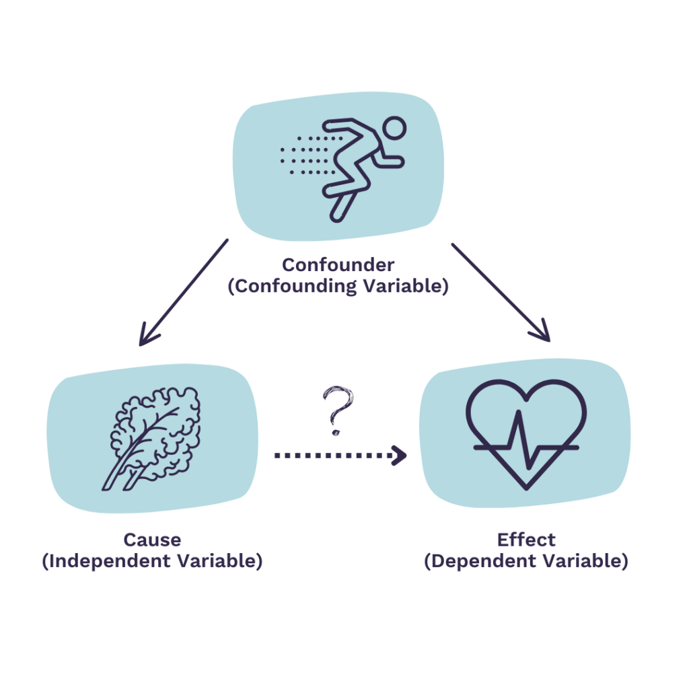
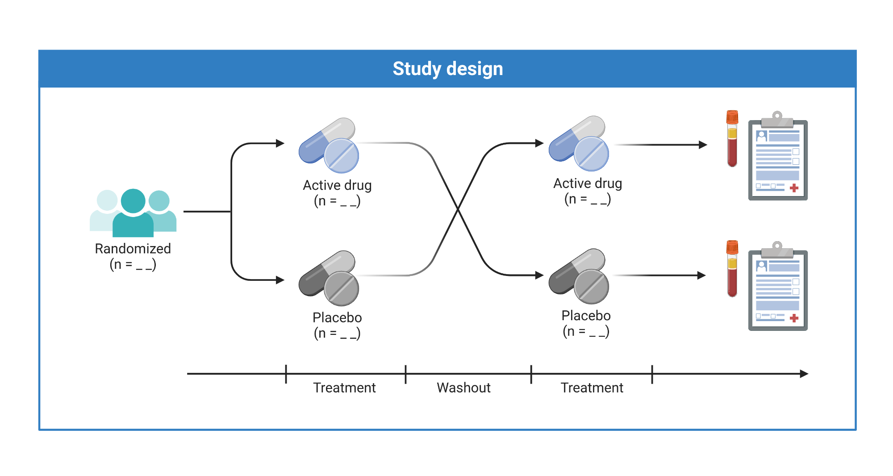

## {}

::: columns

::: {.column width="65%"}

:::{.box-opaque}

::: {.dateplace}

   

:::

::: {.title}



:::

:::

:::

::: {.column}

{.image-right}

:::

:::

## Dr. Alicia Rich *she/her*

:::{.columns}

::: {.column width = "40%"}

Assistant Professor of Biology

Environmental Science Program

{width=70%}

:::

::: {.column width = "60%"}

{width=300px} 

Director, Rich Lab for Molecular Health 

Office Hours
: Allwine Hall 413
: [Remotely via Zoom](https://zoom.us/launch/chat?src=direct_chat_link&email=aliciarich%40unomaha.edu)
: Tues 11-1 or Thur 1-2

:::{.fragment}

:::{.callout-note}

[Use this link to book a meeting](https://outlook.office.com/bookwithme/user/c35af21f7b904e7d82e5cffc9144bce2@nebraska.edu/meetingtype/OBbQKPv_8U-i7oMmPayEZg2?anonymous&ismsaljsauthenabled&ep=mlink)

:::

:::

:::

:::

## Emailing

:::{.columns}

::: {.column width = "60%"}

[aliciarich@unomaha.edu](mailto:aliciarich@unomaha.edu)

:::{.callout-important}

Please do not try to contact me via Canvas Messages

:::

:::

::: {.column width = "40%"}

Before you send an email, make sure you know exactly what a productive response would look like
: A few sentences? 
: A yes or no?
: A specific file?
: A time to meet?

After you send an email, expect a response
: After 24-48 hours (Not in the evenings or on weekends)

::: aside

If you do not hear back from me after 3 days, then please remind me with another email or in class/office hours.

:::

:::

:::

## 1750 Laboratory Policies

- You are required to attend and participate in lab in order to successfully complete this course.
  - If you arrive more than 15 minutes late for a lab, you will be counted as absent from that lab.
  - For EXCUSED absences, making up a lab may be done by switching between lab sections, or if necessary, using resources available in Canvas.
- Your lowest assignment grade and two lowest quiz grades will be dropped. 
- Each lab will begin with a pre/post-lab quiz with questions chosen from a list posted in advance.
  - The quiz will be administered at the beginning of the lab period.
  - If you arrive late, you will miss the quiz.
  - Your name on the quiz form is the method by which attendance is recorded, so if you arrive late (but not more than 15 minutes late) you should ask to put your name on a quiz form, so that you will be recorded as present.

:::{.fragment}

:::{.callout-important}

Plagiarism is UNACCEPTABLE.
: Please read and sign the 1750 policy agreement and submit it before the end of lab today.

:::

:::

:::{.fragment}

:::{.callout-important}

Late reports and assignments
: will suffer a 20% penalty for 1-7 days late and will not be accepted if more than 7 days late.

:::

:::

## 1750 Laboratory Safety

:::{.callout-important}

Special medical concerns: SEE INSTRUCTOR

:::

Be a thoughtful worker in lab.
: Keep your laboratory bench neat and orderly.
: No food or drink in the laboratory.
: Always wash your hands after laboratory (and during).

Restrooms
: out left, down hall on the right. Restrooms on each floor of building.

Be mindful of apparel and PPE choices
: Loose clothing, dangling jewelry and open toe shoes put you at risk.
: Goggles and gloves will be provided when needed. 

Follow all waste disposal guidelines
: Dispose of sharps and broken glass in designated containers.
: Dispose of chemicals and specimens in designated containers.

## 1750 Laboratory Safety

Always report chemical spills to your instructor or TA.
: Eyewash station on front sink. There is no safety shower, so pull out eye wash and use as shower if needed.

Never leave an open flame unattended
: Fire extinguisher by entrance door and in prep room by door.

Emergency exits
: out the door and just left, or out, left, down hall and left.

:::{.fragment}

:::{.callout-important title="In Case of Emergency"}

Emergency number
: 402-554-2911

In case of emergency evacuations
: We will assemble just inside the entrance to the H&K building.

:::

:::

## Prelab Quiz

:::{.r-fit-text}

1. What is an independent variable?
2. What is a dependent variable? 
2. Can a hypothesis be proven to be true? 
3. Which organism will we use as part of the experiment you design in the first lab? 

:::

## Science is a Process

:::{.columns}

:::{.column}

1.  Determine the variables
2.  Design the experiment
3.  Make predictions
4.  Conduct the experiment
5.  Present and analyze the results
6.  Discuss and disseminate

:::

:::{.column}

{width=50%}

:::

:::

## Determine the variables {.center}

:::{.columns}

:::{.column}

:::{.r-fit-text}

Dependent (response)
: what is measured

Independent (explanatory or predictor)
: what is manipulated

Controlled variables 
: what is kept the same

:::

:::

:::{.column}

:::

:::

## Design the experiment

:::{.columns}

:::{.column width=40%}

* Level of treatment 
  - Manipulation is more, less, 25, 85, etc.
* Replication at different levels
  - N subjects (biological)
  - N populations (biological)
  - N treatment replicates (technical)
* Control treatment
  - A “normal” state with which to compare other treatments

:::

:::{.column}

{width=100%}

:::

:::

## Make predictions

:::{.columns}

:::{.column}

:::

:::{.column}

Null hypothesis: 
: *X independent variable has no consistent effect on dependent variable Y.*

Rejecting the null hypothesis
: implies support for the alternative hypothesis

Alternative hypothesis: 
: *X independent variable has more than a chance effect on dependent variable Y.*

To support the alternative hypothesis
: we must reject the null hypothesis

:::{.fragment}

:::{.callout-important}

We never *prove* an alternative hypothesis.

:::

:::

:::

:::

## Science is a Process

:::{.columns}

:::{.column}

:::{.r-fit-text}

1.  Determine the variables
2.  Design the experiment
3.  Make predictions
4.  Conduct the experiment
5.  Present and analyze the results
6.  Discuss and disseminate

:::

:::

:::{.column}

{width=50%}

:::

:::

## Present and analyze the results

:::{.panel-tabset}

### Violin Plot

![Shannon diversity of the fecal microbiome across fecal consistency scores in an adult male pygmy loris (*Xanthonycticebus pygmaeus*). Violin plots summarize the distribution of Shannon diversity values for each ordinal fecal consistency score, with individual points representing daily observations. Point colors represent sampling date to illustrate temporal dispersion within fecal score categories. This figure shows distributions for descriptive comparison and are not intended to imply normality or continuous scaling of fecal consistency scores.](figures/lab1_shannon_bristol.png){#fig-shannon width="1000px"}

### Scatter Plot

![Longitudinal relative abundance trajectories for representative genera illustrating distinct response timing classifications associated with contextual events. Panels show trajectories for (A) *Phascolarctobacterium*, (B) *Megamonas*, (C) *Segatella*, and (D) *Campylobacter.* Points represent observed relative abundances and curves summarize smoothed temporal trends. Shaded regions indicate the ±7-day window used to assess event-aligned responses, with dashed lines marking the timing of the focal contextual event.](figures/lab1_abund_ts.png){#fig-abund-ts width="1200px"}

### Heatmap

![Longitudinal relative abundances of selected bacterial genera associated with fecal consistency state in an adult male pygmy loris (*Xanthonycticebus pygmaeus*). Heatmap tiles represent genus-level relative abundances across sampling dates, with warmer colors indicating higher relative abundance. Symbols along the lower margin denote fecal consistency state on each sampling date (firm vs loose). Genera shown correspond to candidate taxa identified through exploratory mixed-effects modeling and are presented to illustrate temporal variability rather than discrete state shifts.](figures/lab1_abund_brist.png){#fig-abund width="1500px"}

:::

## Discuss and disseminate

One lab report (manuscript) and one presentation will be required during the semester.

* Title page/slide
* (Abstract)
* Introduction
* Methods 
* Results
* Discussion
* References

:::{.callout-important}

Reference Lab 1 when writing your reports.

:::

## Today's Lab: The Scientific Method and Experimental Design

:::{.callout-important}

Turn in Assignment Sheets at end of Lab period (20 points)

:::

:::{.columns}

:::{.column}

### Exercise 1

The Scientific Method
: * Find, read and assess a scientific paper about termites

:::{.fragment}

:::{.callout-note}

Focus on hypotheses and types of variables

:::

:::

:::

:::{.column}

### Exercise 2

Experimental Design
: * Design and conduct an experiment about termite behavior

:::{.fragment}

:::{.callout-note}

Focus on testing your hypothesis and replication

:::

:::

:::

:::

## Exercise 1: Scientific Method

1.  Find, read and assess a scientific paper about termites
  - Skim whole paper
  - Focus on the two tables
  - There are two different main experiments

2.  Choose ONE experiment (independent variable) to focus your answers
  - Answer the questions on Assignment Sheet

:::{.fragment}

:::{.callout-important}

Spend ONLY 45 minutes on this exercise.
: Be done at 10:15 am.

:::

:::

## Exercise 2: Experimental Design 

1.  Design and conduct an experiment about termite behavior
  - Read manual

2.  Construct two statements: the null hypothesis and the alternative hypothesis

3.  Design your experiment (Have TA/instructor check)
  - Dependent and independent variables
  - Replication at two levels
  - Answer questions on Assignment Sheet

## Reminders {.center}

:::{.callout-important title="No quiz next week!"}

The Introduction writing assignment takes the place of the pre-lab quiz.

Due at the beginning of lab next week.

:::
