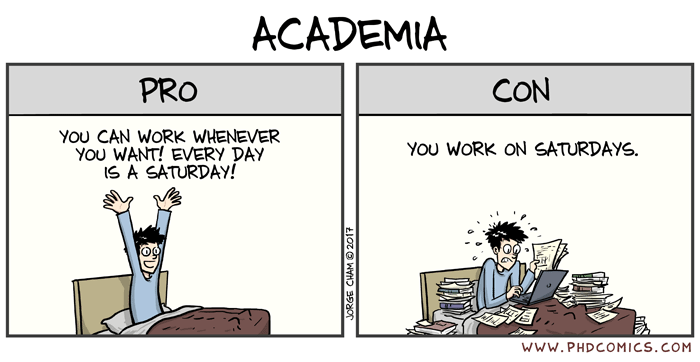
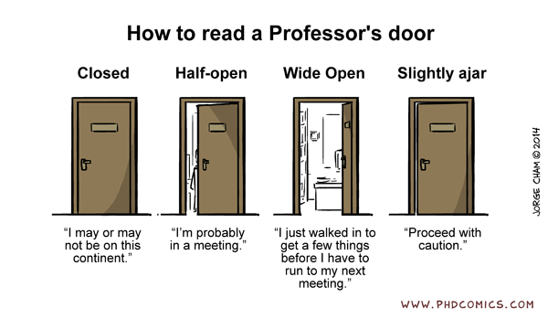
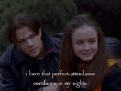
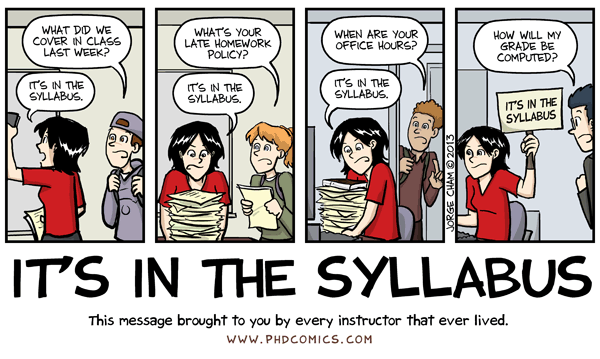
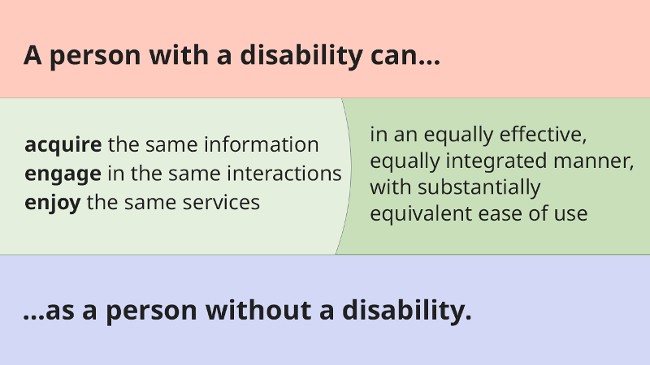
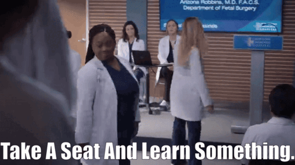
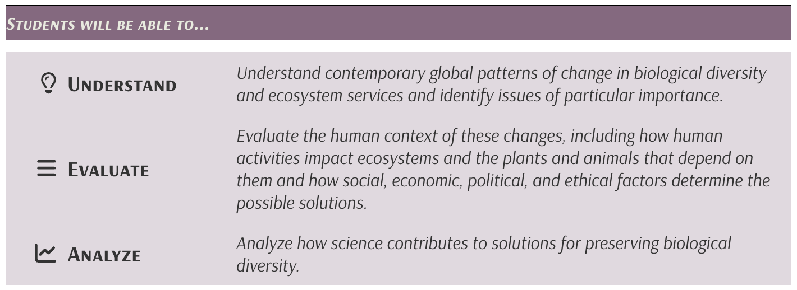
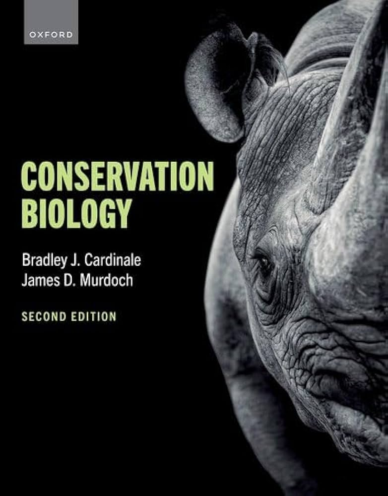
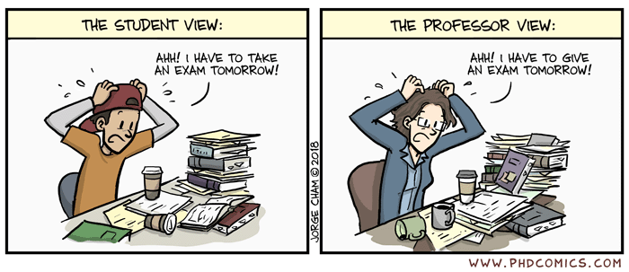
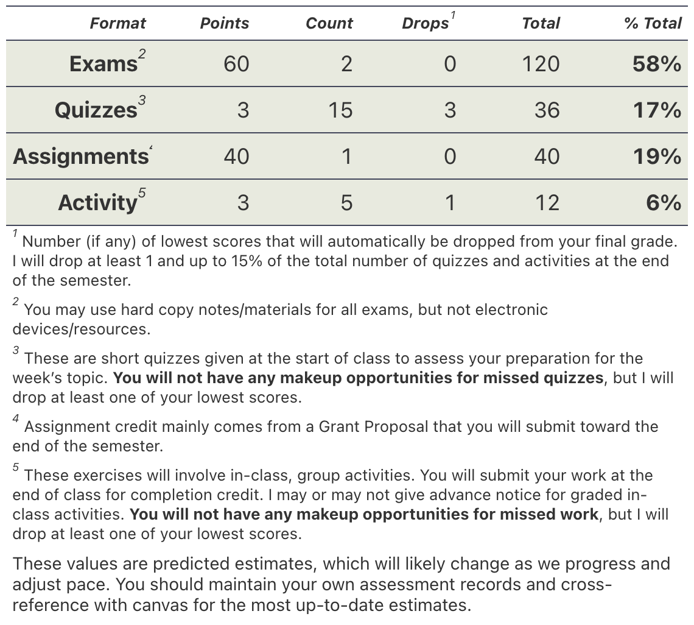

```{r setup, include = FALSE}
here::i_am("slides/conbio/0_conbio_syllabus_overview.qmd")
source(here::here("_common.R"))
```

## Introductions

## Dr. Alicia Rich *she/her*

:::{.columns}

::: {.column width = "40%"}


:::

::: {.column width = "60%"}

- Assistant Professor of Biology
- Environmental Science Program
- {width=100px} Molecular Ecologist, Primatologist

:::

:::

## If you Need my Help {.smaller}

:::{.columns}

::: {.column width = "60%"}


[aliciarich@unomaha.edu](mailto:aliciarich@unomaha.edu)

::: aside

**Please do not try to contact me via Canvas Messages**

:::

:::

::: {.column width = "40%"}

- Before you send an email, make sure you know exactly what a productive response would look like
  - A few sentences? 
  - A yes or no?
  - A specific file?
  - A time to meet?

:::

:::


## If you Need my Help {.smaller}

:::{.columns}

::: {.column width = "60%"}


[aliciarich@unomaha.edu](mailto:aliciarich@unomaha.edu)

::: aside

**Please do not try to contact me via Canvas Messages**

:::

:::

::: {.column width = "40%"}


- A few sentences, A yes or no, A specific file, A time to meet
  - All good reasons to send an email
- More than a few sentences will require a meeting
- For venting or emotional/personal support, make use of [Counseling and Psychological Services](http://www.unomaha.edu/counseling-and-psychological-services).

:::

:::

## If you Need my Help {.smaller}

:::{.columns}

::: {.column width = "40%"}

- Expect 24-48 hours for a response to emails
- Not in the evenings or on weekends
  - I don't schedule meetings at these times either
  
:::

::: {.column width = "60%"}

{fig-align=center}


[aliciarich@unomaha.edu](mailto:aliciarich@unomaha.edu)

:::

:::

::: aside

If you do not hear back from me after 3 days, then please remind me with another email or in class/office hours.

:::

## Office Hours

- **Allwine Hall 413**
- [Remotely via Zoom](https://zoom.us/launch/chat?src=direct_chat_link&email=aliciarich%40unomaha.edu)
- **Tues 11-1 or Thur 1-2**

:::{.callout-note}

[Use this link to book a meeting](https://outlook.office.com/bookwithme/user/c35af21f7b904e7d82e5cffc9144bce2@nebraska.edu/meetingtype/OBbQKPv_8U-i7oMmPayEZg2?anonymous&ismsaljsauthenabled&ep=mlink)

:::

{fig-align=center}

## Classroom Culture

## Values

<u>**Authenticity**</u> --- *Curiosity* --- *Responsibility*

```{r}
slide_list_cols(
  slides_value_list[["Authenticity"]],
  head_left = span(shiny::icon(name = "circle-check", class = "fa-solid"), "Do"),
  head_right = span(shiny::icon(name = "ban", class = "fa-solid"), "Don't")
  )
```

## Values

*Authenticity* --- <u>**Curiosity**</u> --- *Responsibility*

```{r}
slide_list_cols(
  slides_value_list[["Curiosity"]],
  head_left = span(shiny::icon(name = "circle-check", class = "fa-solid"), "Do"),
  head_right = span(shiny::icon(name = "ban", class = "fa-solid"), "Don't")
  )
```

## Values

*Authenticity* --- *Curiosity* --- <u>**Responsibility**</u>

```{r}
slide_list_cols(
  slides_value_list[["Responsibility"]],
  head_left = span(shiny::icon(name = "circle-check", class = "fa-solid"), "Do"),
  head_right = span(shiny::icon(name = "ban", class = "fa-solid"), "Don't")
  )
```


## Expectations

```{r}
slide_list_cols(
  roles,
  head_left = span(shiny::icon(name = "chalkboard-user", class = "fa-solid"), "My Role"),
  head_right = span(shiny::icon(name = "users", class = "fa-solid"), "Your Role")
  )
```

::: aside

**This means <strong>take your own notes</strong>*

:::

## Attendance {.smaller}

:::{.columns}

:::{.column width="40%"}

- Not a hybrid or asynchronous course
  - *I only present content during class time.*
  - *I only offer one opportunity for participation*
  
:::

:::{.column width="60%"}



:::

:::

- I build in flexibility to allow everyone to miss occasionally without penalty
  - I do not micromanage attendance
  - Excuses are not necessary
  - Collaborate with classmates to get notes or ask what you missed


## Instructor cringe


:::{.columns}

:::{.column width="40%"}

- *"What did I miss?"*
- *"Will this be on the test?"*
- *"Do we need to take notes on this?"*
- *"When can you set aside time to help me catch up on all the classes I missed this semester?"*

:::

:::{.column width="60%"}



:::

:::

## Accessibility & Inclusion {.smaller}


:::{.columns}

:::{.column width="50%"}

{fig-align=left}

:::

:::{.column width="50%"}

>"Educational materials and technologies are “accessible” to people with disabilities if they are able to “acquire the same information, engage in the same interactions, and enjoy the same services” as people who do not have disabilities." <small>--*Joint Letter US Department of Justice and US Department of Education*</small>

:::

:::


#### Accessibility Services Center (ASC)

[](https://kea.accessiblelearning.com/unomaha)


## Course Overview


## Student Learning Outcomes {.center}


{width=400px fig-align=center}

{width=700px fig-align=center}

## Required Materials

:::{.columns}

:::{.column width = "40%"}



:::

:::{.column width = "60%"}

- eText via IA Bookshelf
  - *Opt out by next week*
- Assigned readings in [Course Schedule](https://rich-molecular-health-lab.github.io/courses/conbio/schedule.html)

:::

:::


## Quizzes

- Preparation check-ins at the start of class
  - 1-4 questions (5 points)
- Use your phone, tablet, or laptop
- Open book/note
  - ***But no AI/chatBots allowed***

::: aside

No makeup options, but the lowest scores will be dropped (*15% of total number of quizzes*).

:::

## In-Class Work

- Submitted at the end of class for completion credit
  - same value as a quiz (5 points)
- Notice may or may not be given on the [Course Schedule](https://rich-molecular-health-lab.github.io/courses/conbio/schedule.html)

::: aside

No makeup options, but the lowest scores will be dropped (*15% of total number of quizzes*).

:::

## Guided Case Conversations

:::{.callout style="font-size:0.8em"}

In this recurring assignment, students will work in small groups to **lead a structured, whole-class discussion** focused on a **real conservation action or management decision**.

:::

:::{.r-stack}

:::{.fragment .fade-out fragment-index=1}

:::{.callout title="Acceptable examples include"}

* Species recovery or management programs
* Habitat protection, restoration, or connectivity initiatives
* Reintroduction, translocation, or captive breeding programs
* Zoo, NGO, or government conservation initiatives
* Conservation education or community-based projects

:::

:::


:::{.fragment .fade-in fragment-index=2}

:::{.callout title="Choose 2 Topics"}

1. Extinction
2. Habitat Loss, Fragmentation, and Degradation
3. Overexploitation
4. Invasive Alien Species
5. Climate Change
6. Species-Level Approaches
7. Community & Ecosystem Approaches
8. Landscape-Scale Approaches

:::

:::

:::


## Exams

**Midterm on Mon, Mar 2** | **Final on Mon, May 4** (5:00 - 7:00 PM)

:::{.columns}

:::{.column width = "40%"}

- 50 points each
- In-person, synchronous, and written
- Multiple choice, True/False, Short Essay

:::

:::{.column width = "60%"}


:::

:::

::: aside

Open book/open-note, but ***hard-copy only***

:::

## Grade Breakdown

:::{.columns}

:::{.column width = "60%"}


:::

:::{.column width = "40%"}


:::

:::

## Schedule

<iframe 
  src="https://rich-molecular-health-lab.github.io/courses/conbio/schedule.html" 
  width="100%" 
  height="600px" 
  style="border: 1px solid #ccc; border-radius: 8px;">
</iframe>

## On Wednesday

:::{columns}

:::{.column}

Before Class
: * Read the Syllabus online
: * Read section 2.2 of the textbook

:::

:::{.column}


:::

:::

