## {}

::: columns
::: {.column width="65%"}

:::{.box-opaque}

::: {.dateplace}
   
:::

::: {.title}

:::

:::

:::

::: {.column}

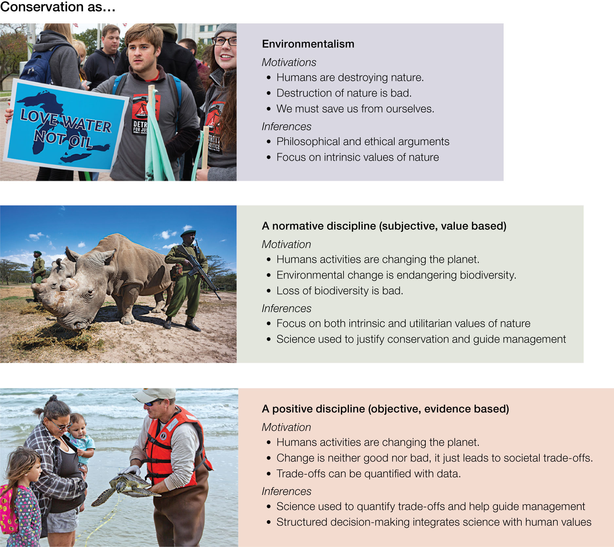{.image-right}

:::
:::

## Historic Context

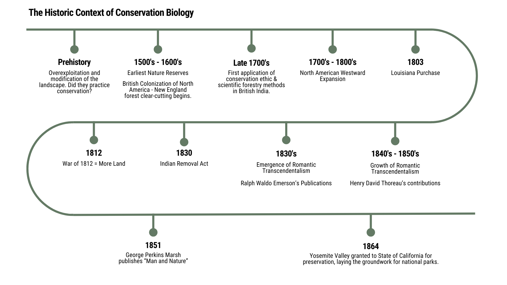

## Historic Context

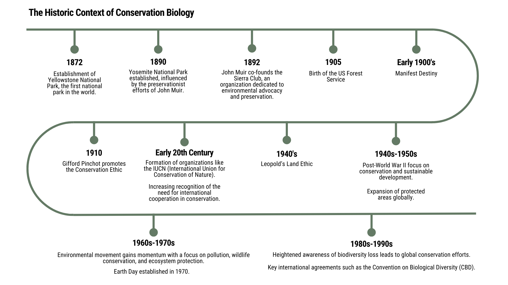

## London's Great Smog (1952)

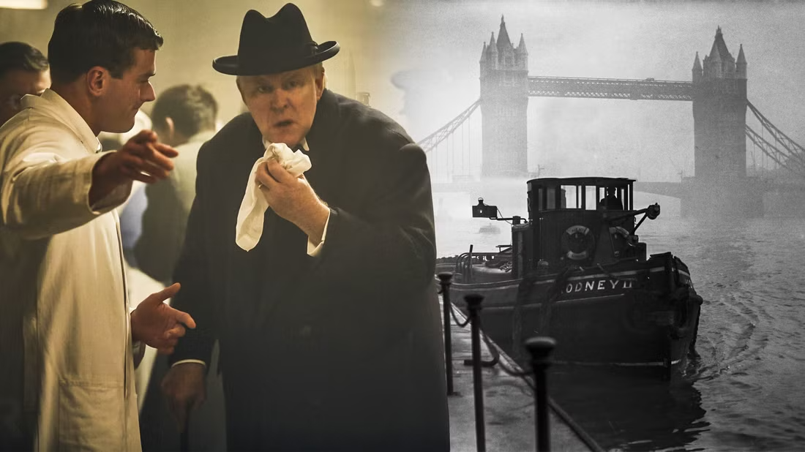

- Airborn nitrogen oxides, sulfur dioxide, and soot **from coal burning**
- Cold weather + windless conditions

:::{.fragment .fade-in}

Result:
: A blanket of smog covered London for five days

:::

::: {.notes}

- Thousands died and 100,000 fell ill
- Cold weather combined with windless conditions allowed airborne nitrogen oxides, sulfur dioxide, and soot from coal burning to form a thick layer of smog over the city.
- Recent research has shown that 12,000 premature deaths can be partially attributed to this smog.

:::

## Love Canal (1953)

Hooker Chemical Company began dumping industrial waste into the Love Canal near Niagara Falls, NY in the 1940s. 

:::{.columns}

:::{.column}

:::{.smaller}

- Love Canal residents reported strange odors and blue goo bubbling into their basements.
- High rates of asthma, miscarriages, mental disabilities, and other health problems brought Love Canal into the spotlight in 1978

:::

:::

:::{.column}

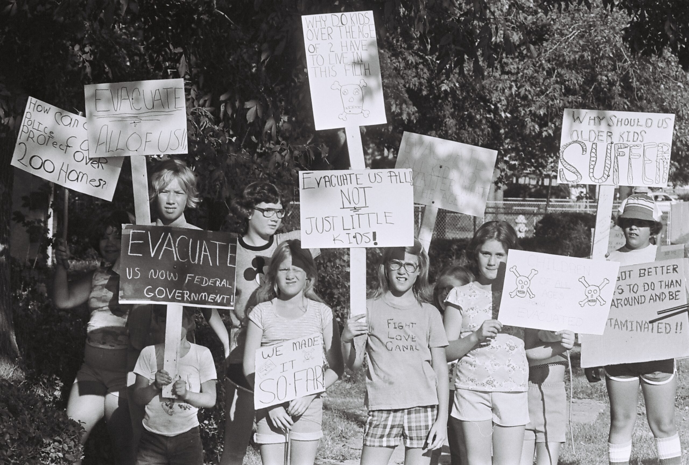

:::

:::

:::{.fragment .fade-in}

:::{.smaller}

**56% of children born there between 1974 and 1978 had birth defects.**

:::

:::

::: {.notes}

- After the site was later sold and developed, Love Canal residents reported strange odors and blue goo bubbling into their basements.
- High rates of asthma, miscarriages, mental disabilities, and other health problems brought Love Canal into the spotlight in 1978, and subsequent surveys found that 56% of children born there between 1974 and 1978 had birth defects.
- New York State Health Commissioner David Axelrod called the incident a “national symbol of a failure to exercise a sense of concern for future generations.” The U.S. government soon after passed the Superfund law.

:::

## Love Canal (1953)

<iframe width="560" height="315" src="https://www.youtube.com/embed/24q62pkeAyI?si=35x_FfmQ-RpFWfjP&amp;controls=0" title="YouTube video player" frameborder="0" allow="accelerometer; autoplay; clipboard-write; encrypted-media; gyroscope; picture-in-picture; web-share" referrerpolicy="strict-origin-when-cross-origin" allowfullscreen></iframe>

## Silent Spring (1962) 

After WWII, DDT was promoted as a wonder chemical

::: {.columns}

:::{.column}

- Rachel Carson published *Silent Spring* in 1962
  - highlighted the dangers & consequences of DDT
  - testified before U.S. Congress

:::

::: {.column}

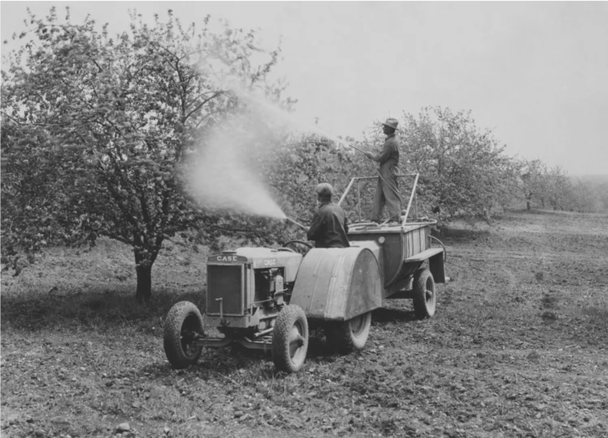

:::

:::

:::{.fragment .fade-in}

**The U.S. Environmental Protection Agency was founded and subsequently banned the use of DDT**

:::

::: {.notes}
- Carson’s book, and testimony before the U.S. Congress, helped trigger the establishment of the U.S. Environmental Protection Agency, which subsequently banned the use of DDT.
:::

## Silent Spring (1962)

<iframe width="800" height="450"
  src="https://www.youtube.com/embed/ezVEzCmiXM4?cc_load_policy=1&cc_lang_pref=en"
  frameborder="0"
  allow="accelerometer; autoplay; clipboard-write; encrypted-media; gyroscope; picture-in-picture"
  allowfullscreen>
</iframe>

## Cuyahoga River (1969) 

Industrial waste poured into Cleveland's Cuyahoga River over decades

:::{.columns}

:::{.column}

:::{.fragment .fade-in fragment-index=1}

The river repeatedly caught fire over several years.

:::

:::{.fragment .fade-in fragment-index=2}

:::{.callout}

In 1969 the photo on the right made it to the front page of *Time Magazine* and catalyzed a nationwide movement

:::

:::

:::

:::{.column}

:::{.fragment .fade-in fragment-index=1}

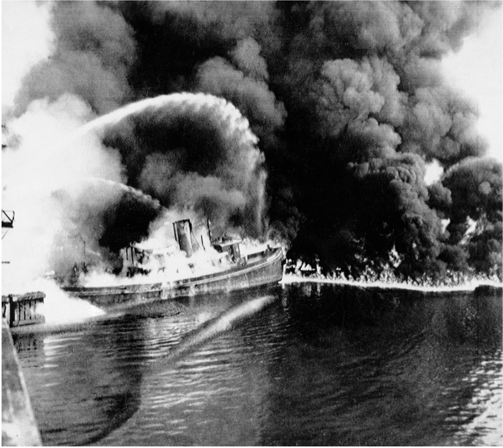{height=400px}

:::

:::

:::

## Cuyahoga River (1969)

<iframe width="800" height="450"
  src="https://www.youtube.com/embed/nlHiaZFvcXA?cc_load_policy=1&cc_lang_pref=en"
  frameborder="0"
  allow="accelerometer; autoplay; clipboard-write; encrypted-media; gyroscope; picture-in-picture"
  allowfullscreen>
</iframe>

## Earth Day (1970)

:::{.columns}

:::{.column width="30%"}

:::{.smaller}

The first official Earth Day (April 22, 1970) marks a turning point in Environmental awareness and activism, particularly in the US, Canada, and Europe.

:::

:::

:::{.column width="70%"}

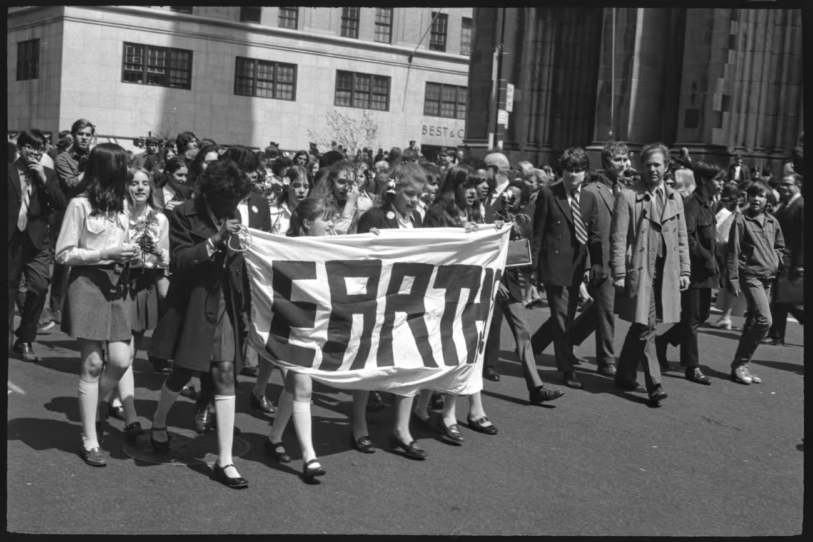

:::

:::

:::{.fragment .fade-in}

:::{.callout}

This also correlates with the emergence of Conservation Biology as a scientific discipline.

:::

:::

::: {.notes}

- Ecologist Michael Soulé organized the First International Conference on Research in Conservation Biology in 1978

:::

## Earth Day (1970)

<iframe width="800" height="450"
  src="https://www.youtube.com/embed/pCcxIQYdH24?cc_load_policy=1&cc_lang_pref=en"
  frameborder="0"
  allow="accelerometer; autoplay; clipboard-write; encrypted-media; gyroscope; picture-in-picture"
  allowfullscreen>
</iframe>

## An Interdisciplinary Field

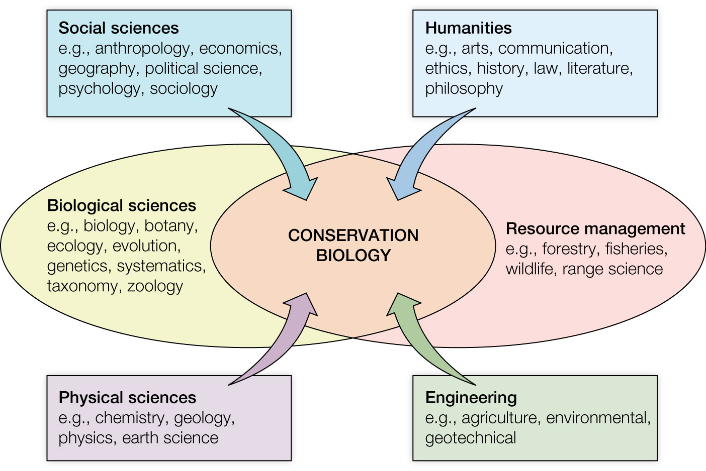{height=500px}

::: {.notes}
- Soulé proposed a new interdisciplinary approach that could help save plants and animals from the threat of human-caused extinctions.
- Though founded in the disciplines of biological sciences and natural resource management, conservation has expanded to include the social sciences, humanities, physical sciences, and engineering.

:::

## A Crisis Discipline

Practitioners must take action even in the absence of complete information, because waiting to collect the necessary data may result in irreversible loss.

<iframe width="800" height="450"
  src="https://www.youtube.com/embed/AeZbbEaLj4c?cc_load_policy=1&cc_lang_pref=en"
  frameborder="0"
  allow="accelerometer; autoplay; clipboard-write; encrypted-media; gyroscope; picture-in-picture"
  allowfullscreen>
</iframe>

::: {.notes}

- Soulé argued that conservation biology differs from most other biological sciences in that it is a crisis discipline
- Conservation biologists are often asked for advice and input by government and private agencies.  
- Therefore, the “expert” is expected to provide quick, unambiguous answers even in the absence of complete knowledge. 
- This is a major challenge for conservation biologists, who must walk a fine line between scientific credibility and taking action and providing advice based on general and perhaps incomplete knowledge

:::

## Views of Conservation 

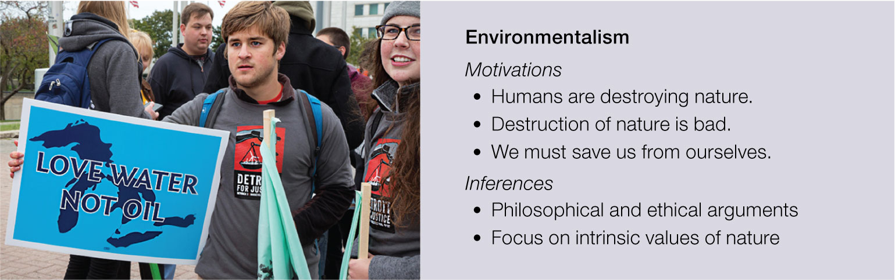

::: {.notes}

- Soulé argued that conservation biology was more than just environmentalism, in which decision-making was based largely on philosophical, religious, and ethical arguments
:::

## Views of Conservation 

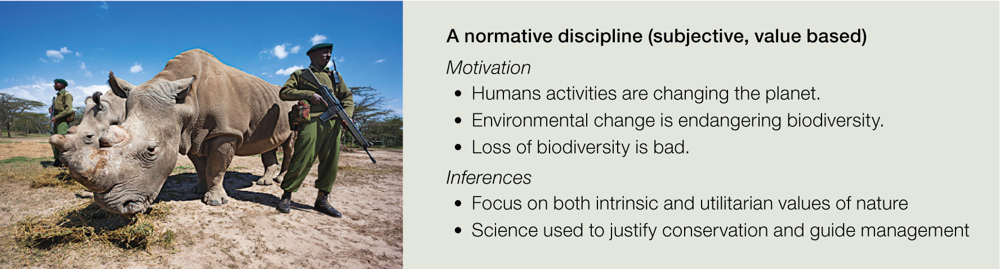

::: {.notes}

- Soulé argued that conservation biology was a form of normative science
- Soulé went on to outline what he called the functional and normative postulates that, in his view, represent the core principles and values of the field

:::

## Views of Conservation 

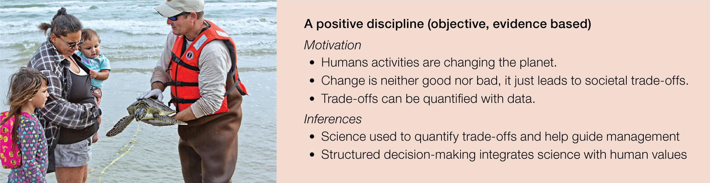

::: {.notes}

- People are motivated to conserve biodiversity for a large variety of reasons
  - some of which are based on normative viewpoints and others of which are based on positive viewpoints. 
- While one type of motivation is sometimes emphasized over the other, rarely do we treat those motivations as if they are mutually exclusive in any real act of decision-making. 
- Complementary, because different people respond to different value systems.

:::

## {}

{.image-right}

::: {.notes}

- People are motivated to conserve biodiversity for a large variety of reasons
  - some of which are based on normative viewpoints and others of which are based on positive viewpoints. 
- While one type of motivation is sometimes emphasized over the other, rarely do we treat those motivations as if they are mutually exclusive in any real act of decision-making. 
- Complementary, because different people respond to different value systems.

:::

## Wrapping Up

<iframe 
  src="https://rich-molecular-health-lab.github.io/courses/conbio/schedule.html" 
  width="100%" 
  height="600px" 
  style="border: 1px solid #ccc; border-radius: 8px;">
</iframe>

