## {}

::: columns
::: {.column width="65%"}

:::{.box-opaque}

::: {.dateplace}
 - 
:::

::: {.title}

:::

:::

:::

:::

::: {.column}

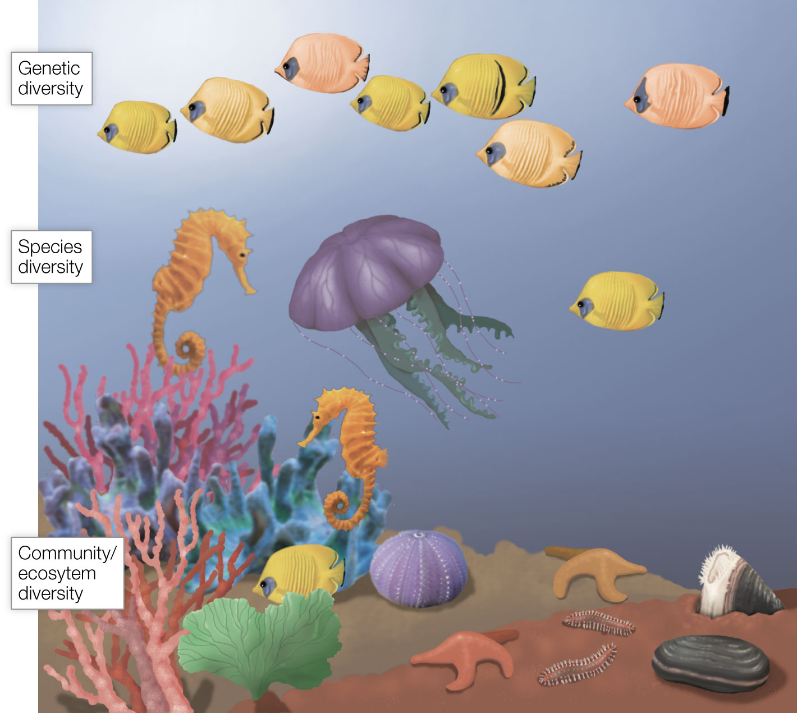{.image-right}

:::

## 3.1 Hierarchical Levels of Biodiversity

:::{.columns}

:::{.column}

::: {.img-frame}

:::

:::

:::{.column}

Genetic diversity
: The genetic variation within species, both among individuals within single populations and among geographically distinct populations
 
 

Species diversity
: The variety of species that comprise a biological community—the collection of species that occupy and interact in a particular location
 
 

Community and ecosystem diversity
: The different biological communities and their associated ecosystems that comprise whole landscapes
 
 

:::

:::

::: {.notes}

Biological variation is a continuum, and it is notoriously difficult to divide life into discrete categories.

:::

## 3.2 Genetic Diversity

## Population-Level

Population
: A group of individual organisms of the same species living within a given (or particular) **geographical area** at **the same time**.

. . .

*How do we define the boundary of that geographical area?*

- Usually defined to be of a size in which individuals are likely to **find mates and reproduce**
- Species that are geographically widespread are often subdivided into **distinct breeding groups** that live in different geographical areas. 
- These geographically separated groups are sometimes referred to as **different populations** of the same species or as **subpopulations** of the species.

## Population Genetics

:::{.columns}

:::{.column}

:::{.img-frame}

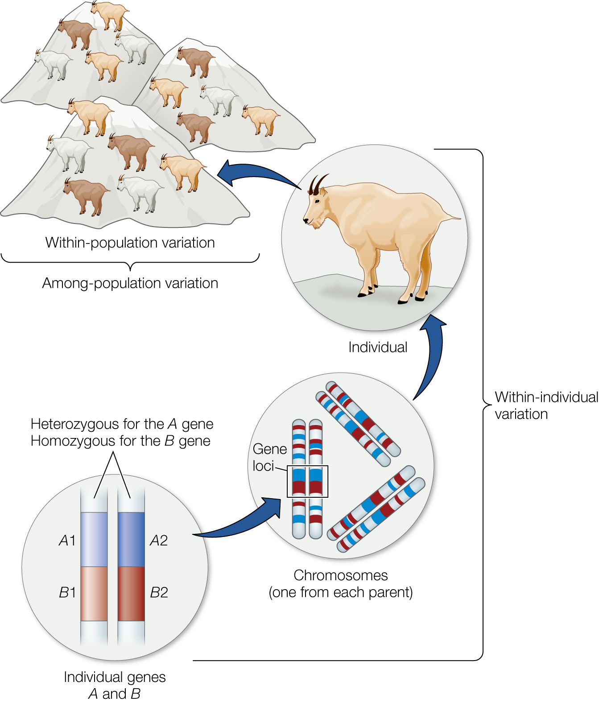

:::

:::

:::{.column}

Individuals all have the same set of **homologous chromosomes**.

 
 

The ____ on those chromosomes are represented by different ____.

:::

:::

## Population Genetics

:::{.columns}

:::{.column}

:::{.img-frame}

:::

:::

:::{.column}

Individuals all have the same set of **homologous chromosomes**.

 
 

The **genes** on those chromosomes are represented by different **alleles**.

:::

:::

## Population Genetics

:::{.columns}

:::{.column}

:::{.img-frame}

:::

:::

:::{.column}

____ are different forms of the same ____. 

:::

:::

## Population Genetics

:::{.columns}

:::{.column}

:::{.img-frame}

:::

:::

:::{.column}

**Alleles** are different forms of the same **gene**. 
 
 
We could also describe them as sequences of DNA that are found on the same gene ______.

:::

:::

## Population Genetics

:::{.columns}

:::{.column}

:::{.img-frame}

:::

:::

:::{.column}

**Alleles** are different forms of the same **gene**.
 
 
We could also describe them as sequences of DNA that are found on the same gene **locus**. 

:::

:::

## Genetic Inheritance

:::{.columns}

:::{.column}

:::{.img-frame}

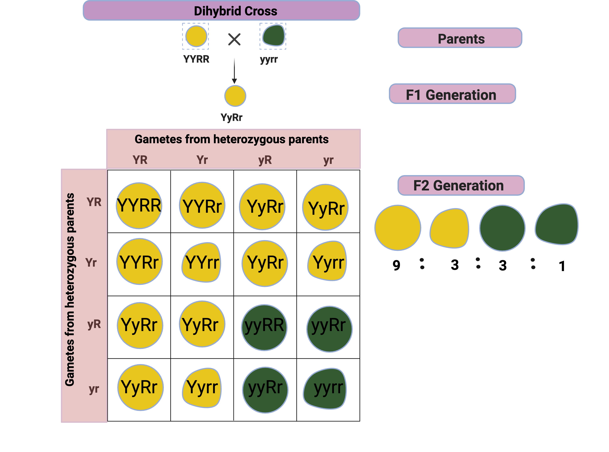

:::

:::

:::{.column}

For the F2 Generation:

- What is the **genotype frequency** of *YyRr*?
- What is the **allele frequency** of *r*?
- If we only consider the *Y* gene, what is the frequency of **heterozygotes?**
- If we only consider the *R* gene, what is the frequency of **homozygotes?**

:::

:::

## Markers in Population Genetics

Polymorphic Locus
: A gene for which more than one allele exists in the population
 
 

Polymorphism
: the fraction of gene loci in which alternative alleles of a gene occur
 
 

:::{.img-frame}

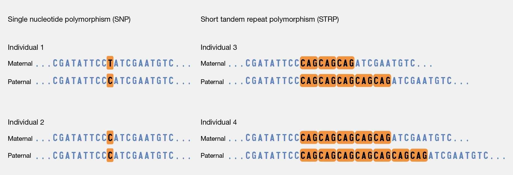{height=300px}

:::

## Measures of Genetic Diversity

:::{.callout}

Run through this example from your textbook on your own to make sure you understand what these metrics represent.

:::

:::{.img-frame}

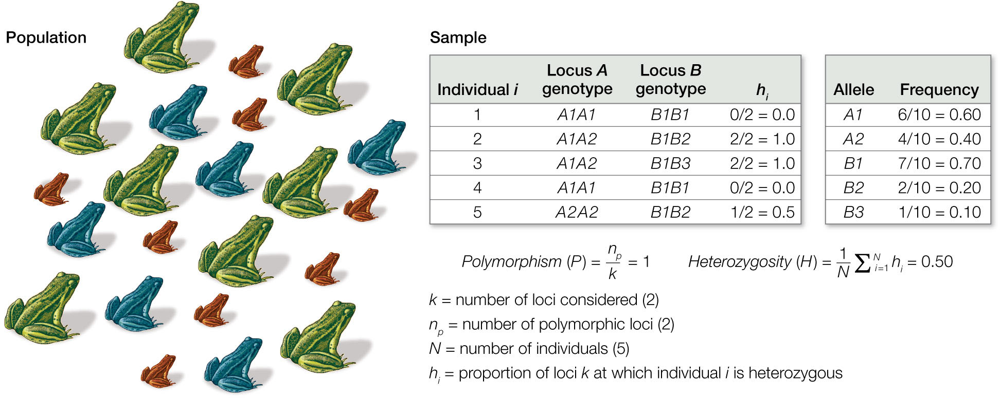
:::

:::{.notes}

This example shows how to calculate polymorphism and heterozygosity of a hypothetical population of frogs (left). 

- Assume that five frogs are sampled randomly such that they are representative of the larger population of frogs. 
- Each of the five frogs is then genotyped to determine which alleles it has at each of two loci: 
  - at locus A it has either allele A1 or A2, while at locus B it has either allele B1, B2, or B3. 
- After genotyping each frog, one can calculate the proportion of loci at which each individual is heterozygous, hi, which is then used to calculate the average heterozygosity, H, of frogs that were sampled. 
- One can also calculate the degree of polymorphism, P, of the sampled frogs, as well as the frequency of each allele in the sampled population.

:::

## Application in Conservation Genetics

<iframe width="900" height="500" src="https://www.youtube.com/embed/oFQmNq8sJ2Y?si=CsFIbCXUJM1_q_UT" title="YouTube video player" frameborder="0" allow="accelerometer; autoplay; clipboard-write; encrypted-media; gyroscope; picture-in-picture; web-share" referrerpolicy="strict-origin-when-cross-origin" allowfullscreen></iframe>

## 3.3 Species Diversity

## Measures of Species Diversity {.center}

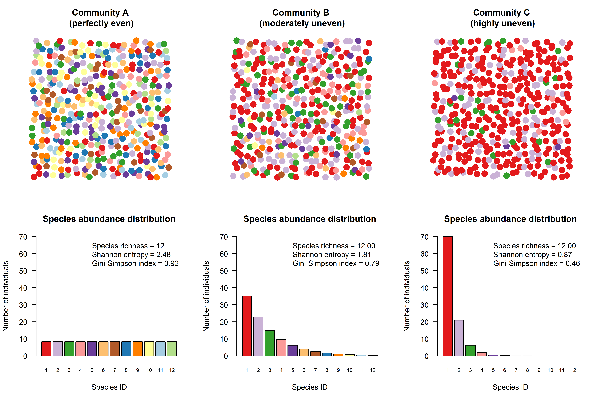{width="70%"}

  

::: aside
Diversity metrics that consider species evenness in addition to richness can be used to represent the higher diversity of species.
:::

## Species Accumulation Curves 

::: columns
:::{.column style="margin-top:100px"}
- Used to show when sampling is [complete]{.green} and [all species]{.green} have been identified
- Quantifies the [number of species]{.green} found *(y)* per [sampling effort]{.green} *(x)*.
:::
:::{.column}
:::{.callout .center}
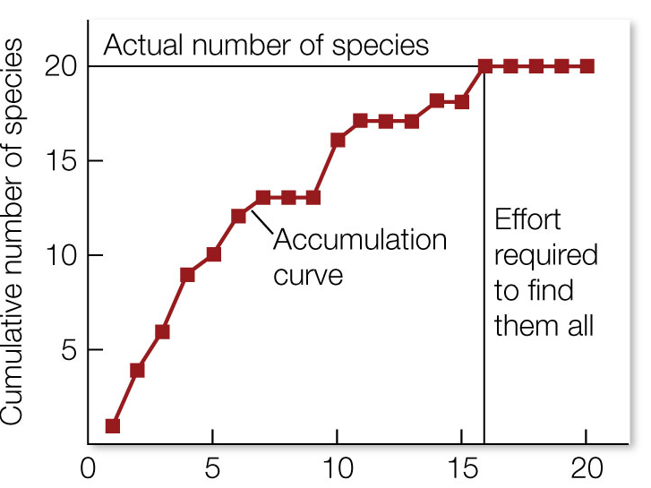
 
<small>N samples</small>
:::
:::
:::

## Extrapolation Curves 

::: columns
:::{.column style="margin-top:100px"}
[Fit to data]{.green} from an Accumulation curve to estimate [how many species]{.green} there might be.

::: aside
Advanced techniques may estimate the asymptotic richness of a collection that has been undersampled.
:::

:::
:::{.column}
:::{.callout .center}
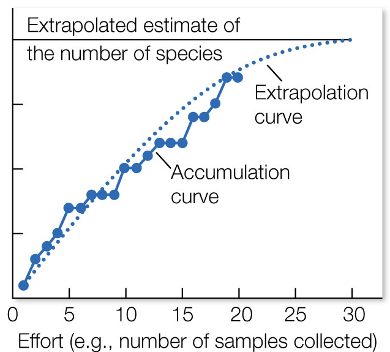
 
<small>N samples</small>
:::
:::
:::

## Comparing Sampling Efforts 

::: columns
:::{.column}

:::{.callout-tip title="At which site would you expect to document more species?"}
::: {.fragment .fade-in fragment-index=1}
- *Probably at Site 1, where sampling effort is greater.*
:::
:::

::: {.fragment .fade-in fragment-index=2}
:::{.callout-tip title="How can we test whether site differences are meaningful?"}
::: {.fragment .fade-in fragment-index=3}
We can [rarefy]{.green} our counts.
  
:::
::: {.fragment .fade-in fragment-index=4}
- [Rarefaction]{.green} randomly selects a subset of observations from each site to equalize the sampling effort.
- The resulting [rarefaction curve]{.green} can be used to compare species richness at the same level of sampling effort.
:::
:::
:::
:::

:::{.column}

:::{.callout .center}

:::{.r-stack}

:::{.fragment .fade-out fragment-index=3}
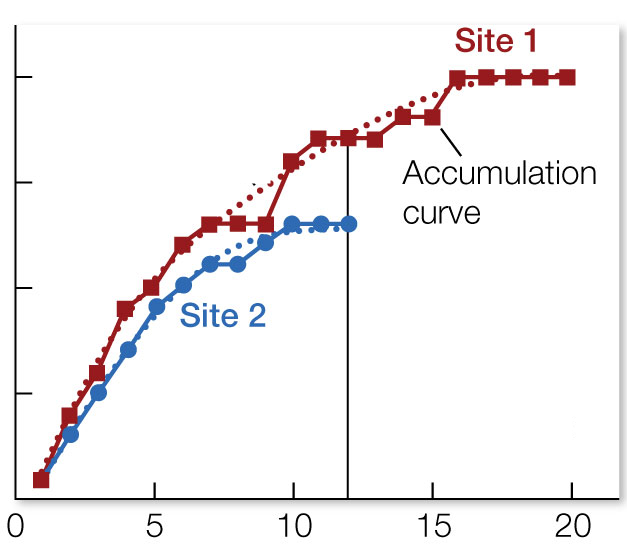
:::

:::{.fragment .fade-in-then-out fragment-index=3}
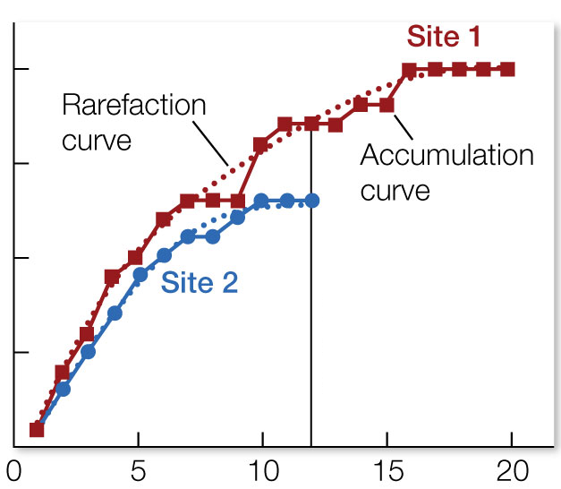
:::
:::{.fragment .fade-in fragment-index=4}
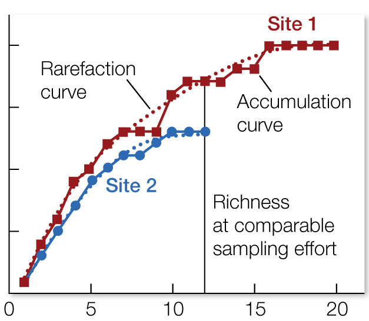
:::
:::

 
<small>N samples</small>
:::

:::
:::

## Species Diversity and Sampling Effort {.center}

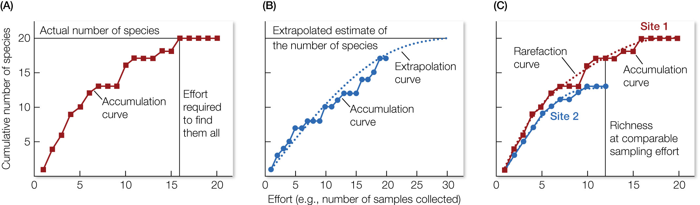

## Scales of Biodiversity 

:::columns
:::{.column width="50%"}
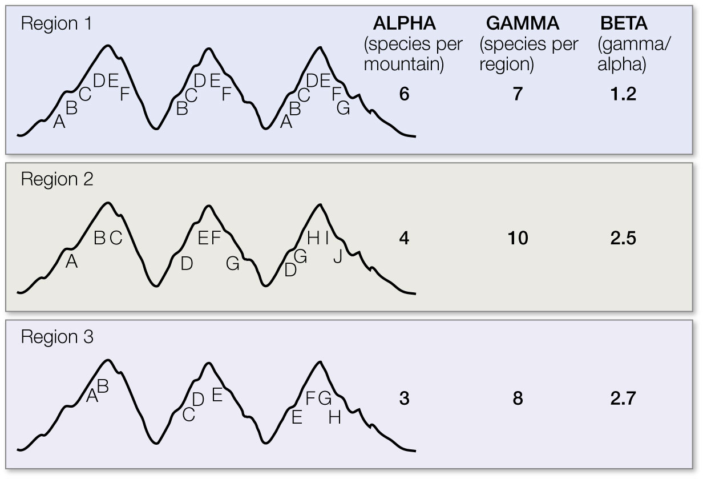
:::

:::{.column}

:::{.fragment .fade-in}
:::{.callout title="If funds were available to protect only one mountain range, which should be selected?"}

:::{.fragment .fade-in}
Region 2 
: the greatest gamma (total) diversity.
:::
:::
:::

:::{.fragment .fade-in}
:::{.callout title="If funds were available to protect only one **mountain**, which should be selected?"}

:::{.fragment .fade-in}
Region 1
: the greatest alpha (local) diversity.
:::
:::
:::

:::{.fragment .fade-in}
:::{.callout title="If region 3 were selected for protection:"}

:::{.fragment .fade-in}
The relative priority of the individual mountains should then be judged based on the relative rarity of the assemblages.
:::
:::
:::

:::
:::

::: notes
Biodiversity indexes for three regions, each consisting of three separate mountains. Each letter represents a population of a species; some species are found on only one mountain, while other species are found on two or three mountains. Alpha, gamma, and beta diversity values are shown for each region. If funds were available to protect only one mountain range, region 2 should be selected because it has the greatest gamma (total) diversity. However, if only one mountain could be protected, a mountain in region 1 should be selected because these mountains have the highest alpha (local) diversity, that is, the greatest average number of species per mountain. Each mountain in region 3 has a more distinct assemblage of species than the mountains in the other two regions, as shown by the higher beta diversity. If region 3 were selected for protection, the relative priority of the individual mountains should then be judged based on the relative rarity of the assemblages.

:::

## 3.4 Functional Diversity

:::{.callout}
[Click here for redirect to Canva slide deck.](https://www.canva.com/design/DAG_FfERNaY/vxZT5mVTR0VmpdhuRhPcgQ/view?utm_content=DAG_FfERNaY&utm_campaign=designshare&utm_medium=link2&utm_source=uniquelinks&utlId=h796e36bed8)
:::

## 3.5-3.6 Community and Ecosystem Diversity

:::{.callout}
[Click here for redirect to Canva slide deck.](https://www.canva.com/design/DAG_FVIhjcU/2-fw-_1UBwV-iLLwMZRJ6A/view?utm_content=DAG_FVIhjcU&utm_campaign=designshare&utm_medium=link2&utm_source=uniquelinks&utlId=h65bb65304b)
:::

