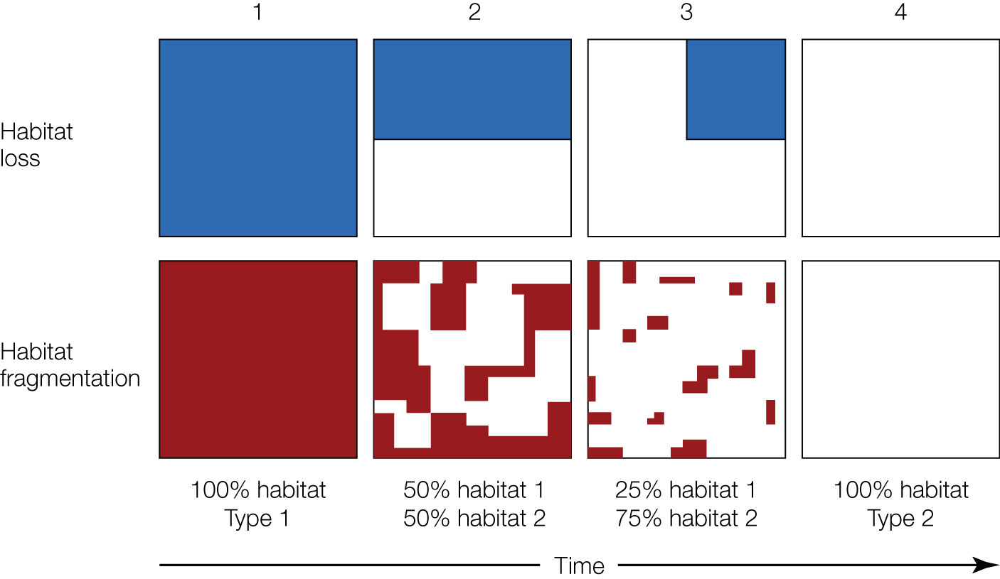

## {}

::: columns
::: {.column width="65%"}

:::{.box-opaque}

::: {.dateplace}
 - 
:::

::: {.title}

:::

:::{.callout}
[Click here for redirect to Canva slide deck.](https://www.canva.com/design/DAGzu-0sWo8/5CssX5zmIofsnNEzPz5ecg/view?utm_content=DAGzu-0sWo8&utm_campaign=designshare&utm_medium=link2&utm_source=uniquelinks&utlId=h7c836ff1ca)
:::

:::

:::

:::

::: {.column}

{.image-right}

:::
