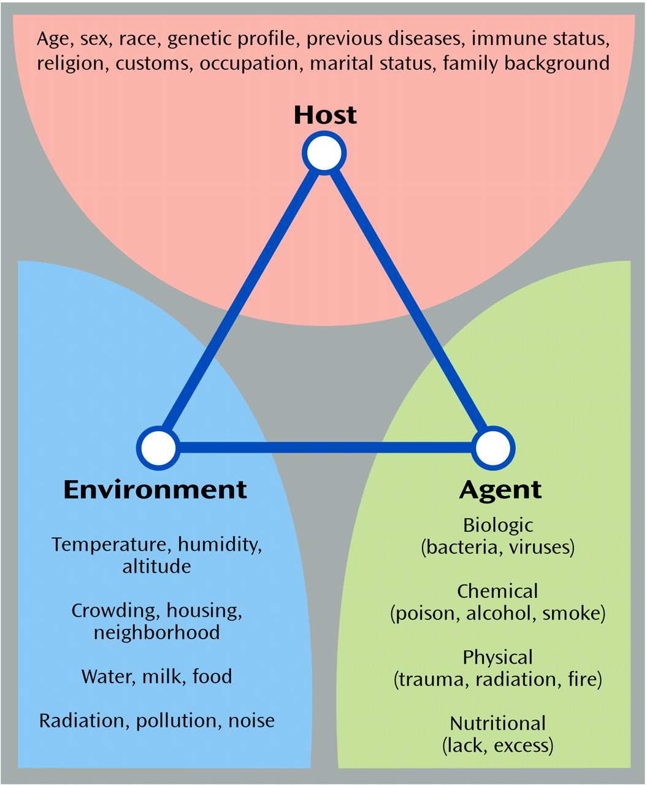
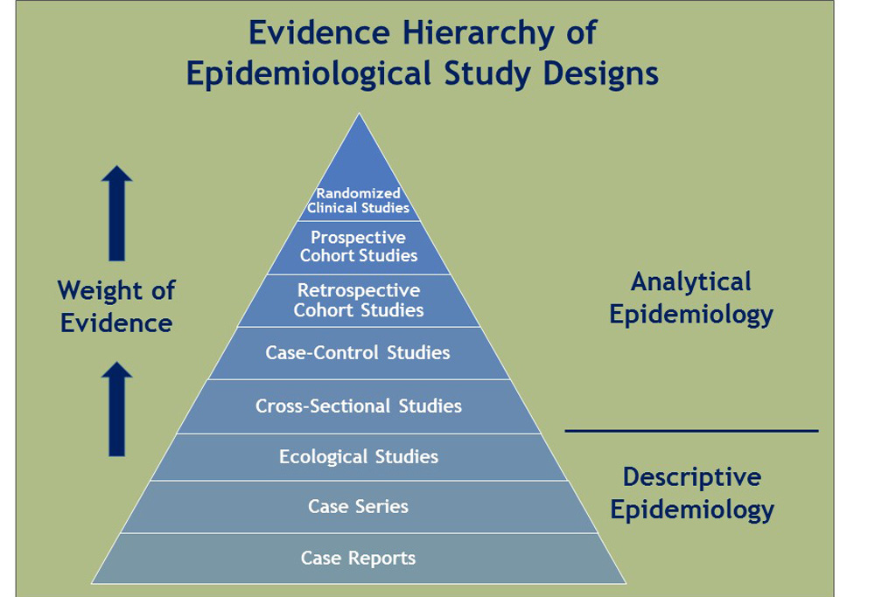
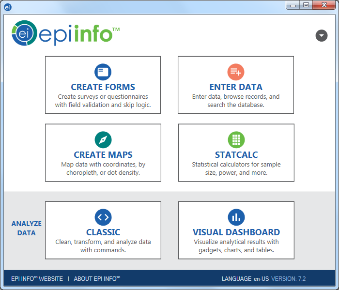
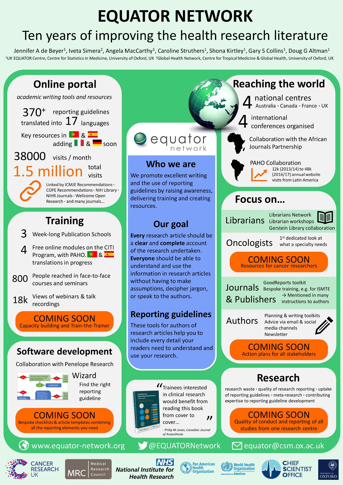
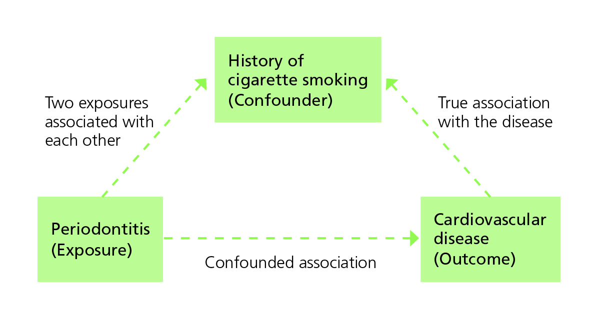
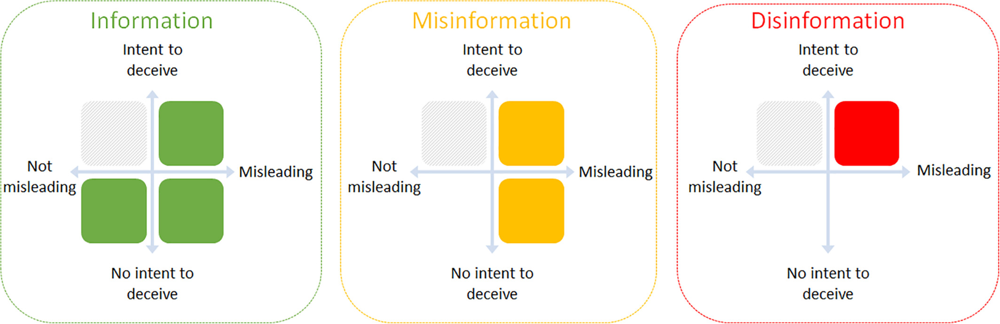
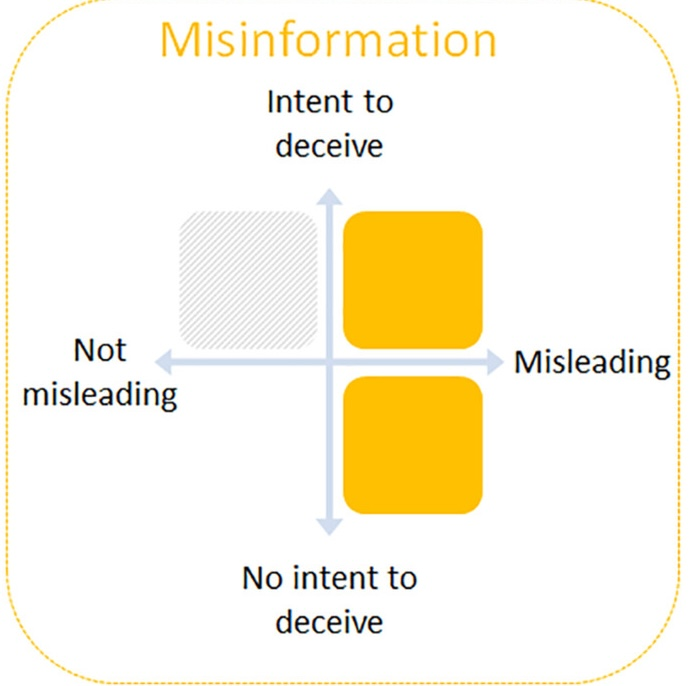
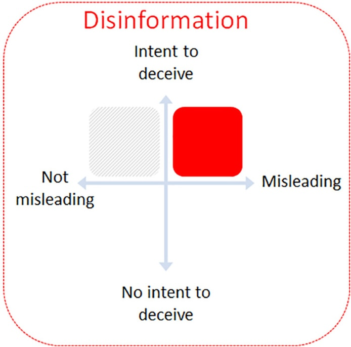
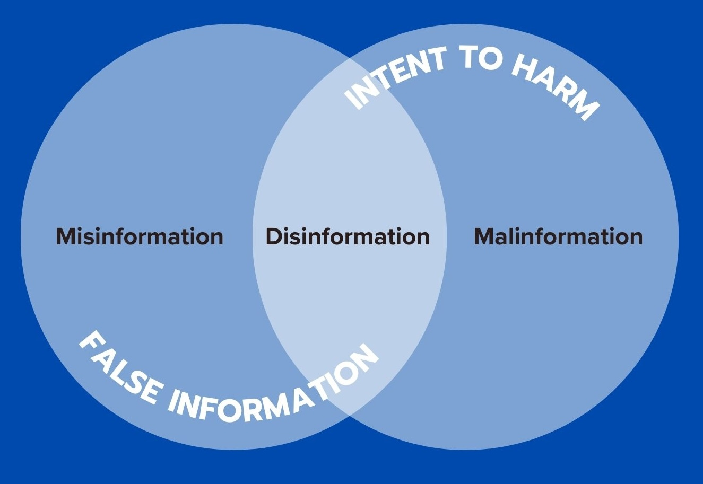

## 



{width="50%"}

# Introduction

## What is epidemiology? {.smaller}

The study of patterns, causes, and effects of health and disease conditions in populations.

Epidemiologists

- ✓ [observe]{.green} health conditions among groups of individuals in populations at risk
- ✓ [offer estimates]{.green} of the severity of the health condition in the population
- ✓ and [identify factors]{.green} and interventions that health programms can target to prevent and control the condition


::: aside
[Recommended reading: *The CDC Field Epidemiology Manual*](https://www.cdc.gov/field-epi-manual/php/about/index.html)
:::

## Research Approaches

::: {.callout-note}
A good research question should

- be [focused]{.green}
- be [relevant]{.green}
- be [meaningful]{.green}
- build on what is [previously known]{.green}
:::

```{r}
library(tidyverse)
library(gt)
library(gtExtras)
tibble(
  Method         = c(
    "Public health surveillance",
"Disease registries",
"Health facility records of health events",
"Civil registration and vital statistics"
  ),
  Definition     = c(
    "Continual systematic monitoring of the occurrence of disease/condition in a population using data from different sources.",
    "Legally mandated systematic registration, in a geographic area, of all individuals who contract a specific chronic disease, with longitudinal follow-up of all relevant events related to each individual.",
   "Continuous systematic, reporting of the occurrences of health events and mandatory reporting of notifiable diseases.",
   "Mandatory continuous recording of all births and deaths (and cause) in a population."
  ),
  Use = c(
"Provides managers with ongoing data of the occurrence and distribution of conditions; can provide real-time warning of when and where an outbreak will occur.",
"Offers detailed information on the incidence and duration, treatment and outcomes of a disease to advise prevention and control policies and programmes.",
"Assists public health departments to plan disease control and prevention policies and programs; and contributes to knowledge of global disease patterns.",
"Supports planning by providing birth and death rates and causes of death."
  ),
  Comments   = c(
    "Requires rapid and efficient long-term collaboration to collect and analyse data across health and other sectors",
"Expensive and difficult to follow-up cases especially in low-income countries; requires efficient long-term collaboration across health facilities and multiple professionals to collect and analyse data.",
"Requires efficient and rapid information systems; trade-off between number of diseases to notify and reporting workload.",
"Not fully functional in many LIMCs where causes of death are hard to ascertain."
  )
) %>%
  gt(rowname_col = "Method") %>%
  gt_theme_pff() %>%
  tab_header("Sources of epidemiological data to inform health policy and manage programs") %>%
  tab_style(cell_text(size = "medium"), locations = cells_title()) %>%
  tab_source_note(md("[Adapted from *The Palgrave Handbook of Global Health Data Methods for Policy and Practice*](https://link.springer.com/book/10.1057/978-1-137-54984-6)"))
```

# Research Questions & Approaches

## 



## Scale of the Problem

*What is the prevalence of a disease/condition, where and among which groups is it prevalent?*

### Cross-sectional Study

*Random samples of individuals in a population at a point in time.*


::: {.callout-note}
[Prevalence rate:]{.green} the proportion of people in a population who have a condition of interest at a point in time (or, for *period prevalence*, during a period of time).
:::

::: {.callout-note title="Approach"}
- Describe the prevalence of the disease/condition by other characteristics of the population.
:::

::: {.callout-note title="Use"}
- Informs about the scale, and demographic and geographical distribution of conditions
- Repeated surveys can establish trends and generate hypotheses
:::

::: {.callout-note title="Caveats"}
- Not useful for rare conditions of very short duration
- Hard to control for confounding or to attribute causality
:::

## Association of Problem with Risk Factors

*Which are the risk groups and factors associated with the disease/condition that an intervention could target?*

### Cohort (Longitudinal) Study

*Follows a well-defined population over time who are exposed to risk factors of interest.*


::: {.callout-note}
[Incidence rate:]{.green} the proportion of people in a population who contract a condition during a period of time.
:::

::: {.callout-note}
[Relative risk (RR):]{.green} the ratio of the incidence of the outcome of interest in a [risk group]{.mark} to the incidence of the outcome in a [comparison group]{.mark}.

- [RR = 1]{.green} → No association between the risk factor and the outcome
- [RR > 1]{.green} → Positive association
- [RR < 1]{.green} → Negative association
:::

::: {.callout-note title="Approach"}
- Compare incidence of a disease/condition in those exposed and in those who are not (relative risk).
:::

::: {.callout-note title="Use"}
- Describes incidence and the course of the condition (prognosis).
- Identifies risk factors to target for interventions.
:::

::: {.callout-note title="Caveats"}
- Takes time.
- Not feasible for rare conditions or diseases with long latency.
- Suitable cohorts can be difficult to identify and costly to follow.
- Ethical considerations include confidentiality and privacy.
:::

## Association of Problem with Risk Factors

*Which are the risk groups and factors associated with the disease/condition that an intervention could target?*

### Case-control (Retrospective) Study

*Selects a group of cases with a disease/condition and a group of controls without the condition (but otherwise similar) and records history of exposure to potential risk factors in both groups.*


::: {.callout-note}
[Odds ratio (OR):]{.green} the ratio of the odds that an outcome occurs in a risk group to the odds that the outcome occurs in a comparison group.

[For uncommon outcomes, the OR approximates the RR for an association.]{.green}
:::

::: {.callout-note title="Approach"}
- Examine odds ratio as a measure of association.
:::

::: {.callout-note title="Use"}
- Rapid way to establish (multiple) risk factors to target for interventions.
- Especially for diseases that are rare or have long latency.
:::

::: {.callout-note title="Caveats"}
- Information collected retrospectively.
- Prone to confounding and measurement bias.
- Difficult to establish a temporal relationship between risk and development of the condition.
- Selection of a suitable control group can be difficult.
:::

## Choice of Treatment or Intervention

*Which intervention to recommend?*

### Randomized Controlled Trial (RCT)

*Randomly assigns consenting participants, groups or communities to an experimental treatment, or to a standard treatment, no treatment, or a placebo.*


::: {.callout-note title="Approach"}
- Mask assignment and limit the knowledge of treatment providers where possible.
:::

::: {.callout-note title="Use"}
- Provides the best available evidence on the efficacy of treatments.
:::

::: {.callout-note title="Caveats"}
- Expensive and cumbersome
- Trade-off between internal and external validity due to selected samples
- Study of harm is not feasible for ethical reasons
- For field interventions findings may not be generalizable beyond the study context.
:::

## Choice of Treatment or Intervention

*Which intervention to recommend?*

### Quasi-experimental Study Designs

*Utilizes control groups which are selected or matched, or statistically simulated, to be as comparable as possible to the subjects exposure to the new intervention.*


::: {.callout-note title="Use"}
- Most useful when RCTs are either logistically infeasible or ethically unacceptable *(e.g., to evaluate the effects of legislation, on entire populations)*.
:::

::: {.callout-note title="Caveats"}
- Each study design has its pros and cons (especially its risk of failure to control for potential confounders)
- Considerable experience is required to judge the most appropriate design for a given situation.
:::

## Research Methods & Ethics

::: {.callout-note}
### [The Equator Network](https://www.equator-network.org/)

Provides online resources for writing protocols and reporting for most types of epidemiological studies.

[Since serious ethical considerations cut through all aspects of design and implementation of studies of people, investigators must gain approval from nationally approved institutional review boards.]{.aside}
:::

::: {.callout-note}
### [Epi Info](https://www.cdc.gov/epiinfo/index.html)

Open source software developed by the CDC to provide customized tools for data entry and analysis, with excellent visualization including maps; it also supports development of small disease surveillance systems.[^1]
:::

[^1]: Note: As of September, 2025, this resource appears to be unavailable.

{width="50%"}

{width="70%"}

## Critical Design Aspects: Participant Selection

Simple random sampling
: not often feasible or appropriate

Stratified sampling
: population is stratified by variables like sex or age

Random stratified sampling
: random sampling within strata described above

Cluster sampling
: investigators sample clusters from a population partitioned into homogeneous groups (or clusters), such as enumeration areas, villages or schools


## Critical Design Aspects: Measurement Accuracy

Disease status can be ascertained by
: examining participants for symptoms and signs consistent with the disease or event using diagnostic laboratory tests
: administering questionnaires or conducting interviews
: reviewing medical records, sometimes by linking subjects from different administrative or research databases

Accuracy requires
: direct laboratory assays for exposure
: careful interviews of cases *(or surrogate information from several sources)*
: using standardized questionnaires to minimize recall bias

To ensure proper data quality, investigators can
: conduct pilot studies
: employ laboratory quality assurance


## Critical Design Aspects: Sample Size

::: {.callout-note}
[Epi Info](https://www.cdc.gov/epiinfo/index.html)[^2] includes a sample size calculator, which addresses the aim of the study, the type of study and the chosen sampling method.

The investigator provides

: a margin of error or width of confidence interval they expect to obtain.
: estimated indicator values via literature review or pilot investigation.

[The smaller the intended margin of error, the larger the required sample size.]{.green}
:::

[^2]: Currently unavailable.

::: notes
To test a hypothesis, the investigator needs to specify:

: The magnitude of a minimum detectable but clinically meaningful difference in the outcome they expect between the exposed and non-exposed groups;
: The probabilities of wrongly concluding there is a difference (a so-called Type I error – say 5%); and
: The probability of wrongly concluding there is no difference (a Type II error – say 20%).

For cohort and case-control studies and surveys, investigators may select participants systematically or use sequential sampling, that is they select elements from the source population based on a random starting point, and then use a fixed interval (usually based on sample size) to select all other elements. Explicit inclusion and exclusion criteria should define the target population and eligible participants. Specific working definitions for these criteria will minimize misclassification of participants, particularly in designs requiring comparison with a control group.
:::

## Bias in Results

::: {.callout-note}
[Bias]{.green} is the extent to which a study systematically underestimates or overestimates the indicator described or the association reported between exposure and the outcome.
:::

## Bias in Results: Selection Bias

In cross-sectional studies
: *when sample members do not represent the population to which the investigator hopes to make inference.*

For case-control or cohort studies
: *poor representativeness may not necessarily lead to bias, unless there is differential sample distortion with respect to exposure and outcome.*

In clinical trials
: *selection bias arises when there are systematic differences between treatment groups in factors that can influence the study outcomes being measured.*


## Bias in Results: Measurement Bias

Occurs through
: errors in recording observations
: participant recall bias
: instrument bias
: misclassification of exposure and disease status


## Counfounders

::: {.callout-note}
What if we fail to account for a key explanatory variable and attribute that variable's contribution to the wrong predictor?
:::

::: {.callout-note}
A [confounder]{.green} is an extraneous variable (not part of the purported chain of causality between exposure and outcome), often unobserved by the investigators, that distorts the relationship between exposure and the outcome of interest.

[Confounding]{.green} happens when the third variable is associated with the exposure while also being a potential cause of the outcome.
:::



## Other Common Pitfalls: Correlation and Causation

“X is linked to Y” ≠ “X causes Y.”

To establish causality after showing association, researchers need to:

1. Satisfy themselves that potential biases have not importantly influenced their conclusions
2. Demonstrate that the risk factor occurred before the health outcome
3. Exclude spurious explanations for the association
4. Describe a plausible chain of causality between the risk factor or treatment and the outcome.

## Other Common Pitfalls: Correlation and Causation

::: {.callout-important}
It is difficult to establish a temporal relationship between risk and development of the condition for case-control studies.

RCTs provide the best form of evidence of causality, *but they may not always be logistically or ethically feasible.*
:::

## Other Common Pitfalls

Absence of Evidence ≠ Evidence of Absence
: We cannot conclude something does not exist or occur just because we have not observed it.

Cherry-picking Studies
: The relative weight of evidence matters.

Overgeneralization
: One study's findings cannot be applied universally.

Relative vs. Absolute Risk
: “Doubles your risk!” might mean from 25% to 75% or from 0.01% to 0.02%.

## Disseminating Results

{.img-border .nostretch}

## Misinformation

False information shared [*without the intention*]{.mark} to mislead.

{.img-border}

## Disinformation

False information [*deliberately created and spread*]{.mark} to deceive or cause harm.

{.img-border}

## Malinformation

Genuine information used [*out of context*]{.mark} to cause harm.

{.img-border}


## Case Study

<iframe width="800" height="450"
  src="https://www.youtube.com/embed/AayZ53_hw4M?cc_load_policy=1&cc_lang_pref=en"
  frameborder="0"
  allow="accelerometer; autoplay; clipboard-write; encrypted-media; gyroscope; picture-in-picture"
  allowfullscreen>
</iframe>

::: {.callout-note title="Can you use this to explain at least one of the following pitfalls?"}
- Selection bias
- Measurement bias
- Confounders
- Correlation and Causation
- Absence of evidence vs evidence of absence
- Cherry-picking studies
- Overgeneralization
- Relative vs. absolute risk
:::

