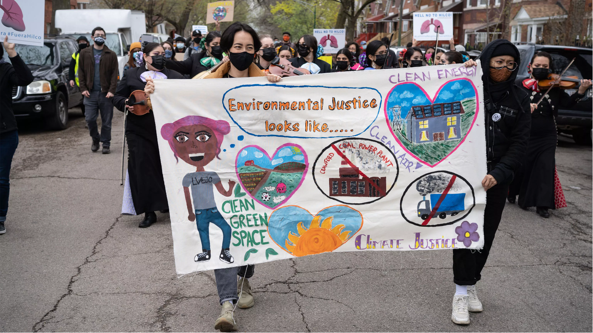
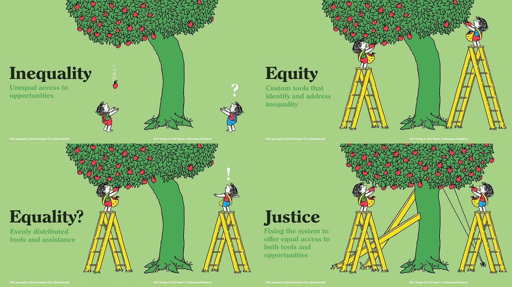
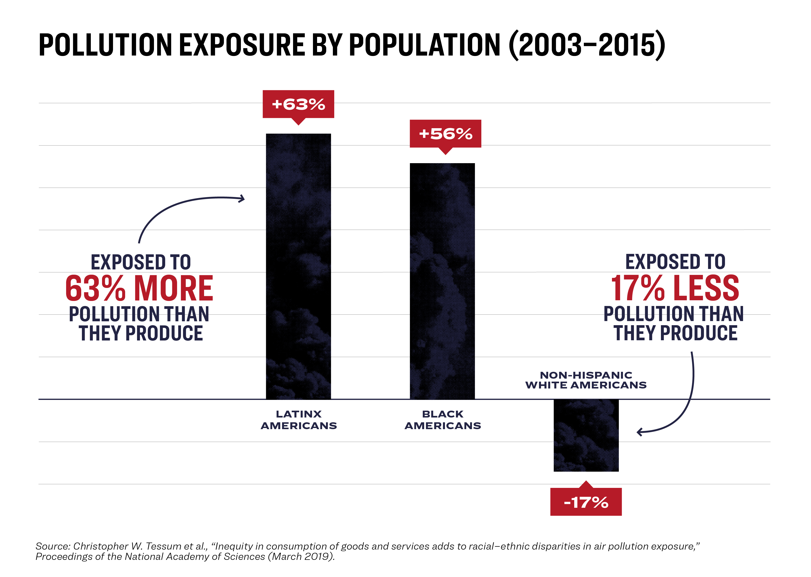
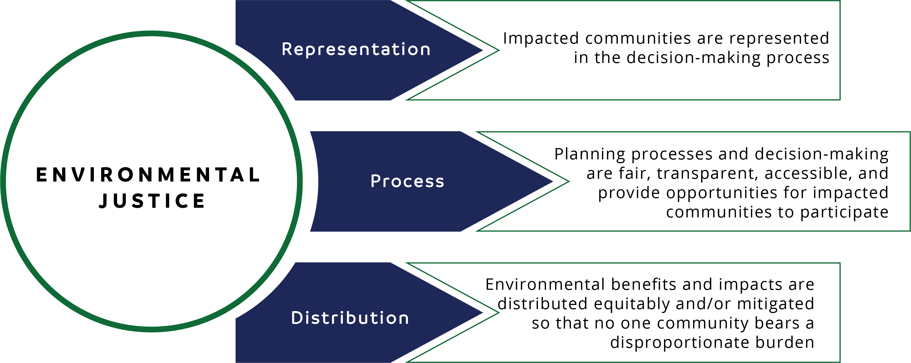

## {}

::: columns
::: {.column width="65%"}

:::{.box-opaque}

::: {.dateplace}
   
:::

::: {.title}

:::

:::

:::

::: {.column}

{.image-right}

:::
:::

## Environmental Justice Defined

{.img-border}

>*The just treatment and meaningful involvement of all people in environmental decision-making to ensure full protection from disproportionate environmental and health impacts, and equitable access to a healthy, sustainable, and resilient environment.* 
 <small> -- U.S. Environmental Protection Agency (EPA) (2024)</small>

## Justice & Equity

{.img-border .nostretch}

::: aside

Everyone is a product of diverse biological and cultural histories, existing in a system that disproportionately benefits those most recently in power.

:::

## Environmental Justice

{.img-border}

::: {.notes}

A landmark 2007 study found “race to be more important than socioeconomic status in predicting the location of the nation’s commercial hazardous waste facilities”. 

https://www.nrdc.org/sites/default/files/toxic-wastes-and-race-at-twenty-1987-2007.pdf

:::

## Environmental Justice

:::{.columns}

:::{.column width=60%}

{.img-border}

:::

:::{.column width=40%}

- Black children were 5x more likely to have lead poisoning than white children were.
- Even black Americans making 50-60K/year were more likely to live in polluted areas than their white counterparts making only 10K/year

:::

:::

::: {.notes}

In the UK meanwhile, a government report found that black British children are exposed to up to 30% more air pollution than white children.

:::

## Environmental Justice

{.img-border}

::: {.notes}

The term “environmental justice” initially referred to the movement that arose to confront environmental racism, but it has since expanded to encompass multiple forms of environmental inequities and problems.

:::

