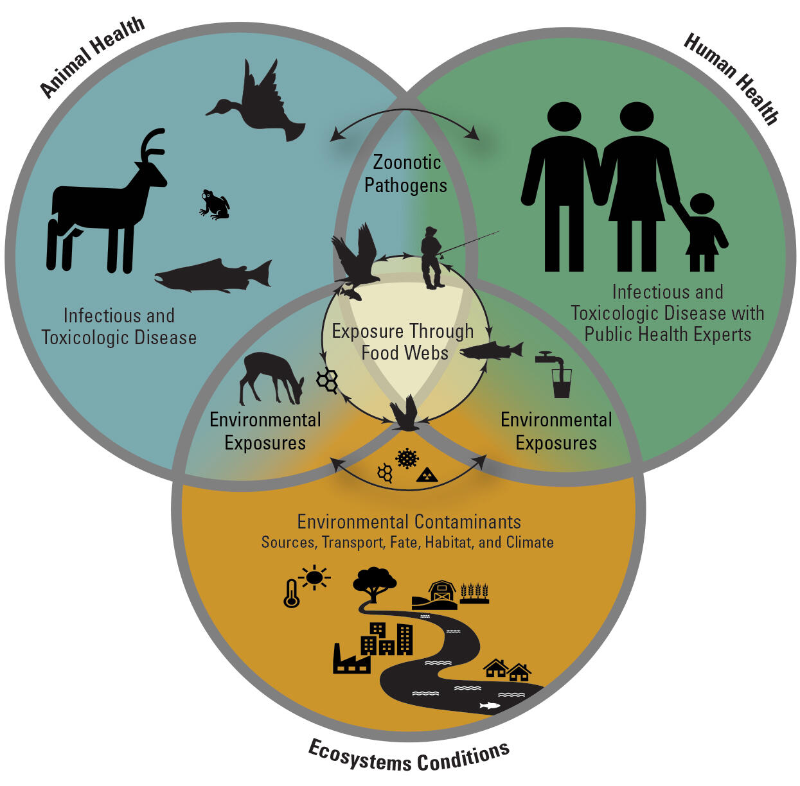
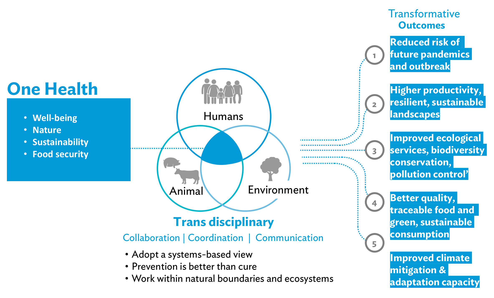
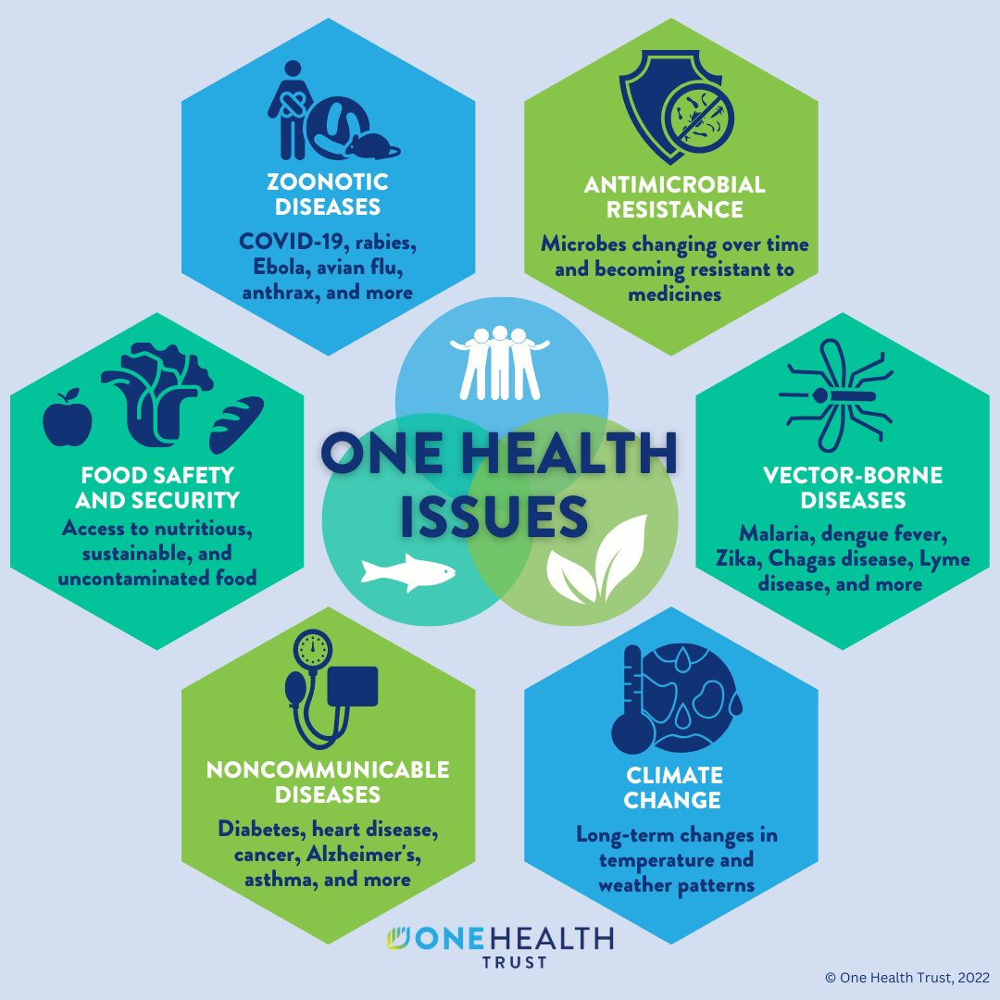

## {}

::: columns
::: {.column width="65%"}

:::{.box-opaque}

::: {.dateplace}
   
:::

::: {.title}

:::

:::

:::

::: {.column}

{.image-right}

:::
:::

## Definition {.vcenter}

::: {.columns}

::: {.column}

::: {.img-frame}

:::

:::

::: {.column .vcenter-left}

- The health of humans, domestic and wild animals, plants, and the wider environment (including ecosystems) are closely linked and inter-dependent.

- One Health aims to sustainably balance and optimize the health of people, animals and ecosystems.

:::

:::

## Scope

::: {.img-frame}

{height=400px}
:::

::: aside

The approach mobilizes multiple sectors, disciplines and communities at varying levels of society.

:::

## Goals

:::{.columns}

:::{.column}

::: {.img-frame}

:::

:::

:::{.column}

- Tackle threats to health and ecosystems
- Address the collective need for clean water, energy and air, safe and nutritious food
- Take action on climate changes and contributing to sustainable development.

:::

:::

