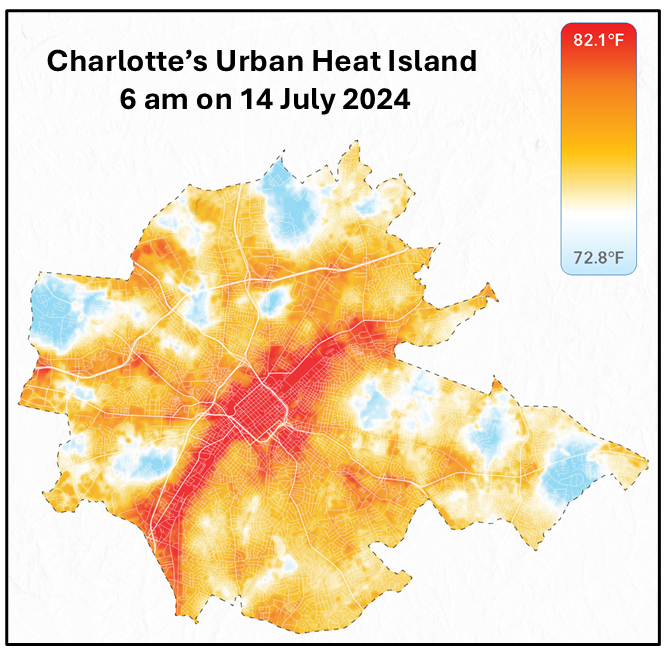

## {}

::: columns

::: {.column width="65%"}

:::{.box-opaque}
::: {.dateplace}
 

:::
::: {.title}

:::
:::

:::

::: {.column width="35%"}

{.image-right}

:::
:::

# Causes of Extreme Heat

## What influences Heat?

While temperature is largely caused by the sun and weather systems there are other factors that influence it. 

:::{.columns}

:::{.column}

### Weather

### Shape of the Land

:::

:::{.column}

### Bodies of Water

### Urban Landscapes

:::

:::

## Weather

### Where the wind comes from

- Winds coming off the water will carry cooler maritime air over the warm land.
- Winds coming over the land will generally be warmer
  - particularly if they're coming from lower latitudes or the desert

### Temperatures in the upper atmosphere

- Temperatures high enough above the surface aren't influenced by daytime changes caused by the sun
  - or low-level winds such as coastal sea breezes
- Air mixing throughout the day brings this upper-level air down.
  - becomes warmer as it approaches the surface
  - Air is more compressed at lower levels, because air pressure increases as height decreases.
  - This compression increases its temperature at a rate of around 10°C/k – a process known as **adiabatic warming**.

## Weather

### Sunlight and Shade

- Air temperature is officially measured in the shade at 2 m off the ground
  - *away from influences that can cause fluctuations in the reading*
  
### Humidity and Wind Chill

- They're not taken into account where temperature is measured.

## Shape of the Land

### Mountains and high places

- Temperatures decrease as height increases, at an average rate of 6.5°C for every 1000m.
  - The atmosphere becomes thinner with height, due to gravity.

### Valleys

- Valleys that dip below sea level record some of the highest temperatures on the planet.
  - Valleys are excellent at collecting and holding hot air that sinks.
- Air moving down the valley from above can also add to the heat.
  - This is called **katabatic wind**
    - *adiabatic warming* is at play.
- Sloping surfaces around the valley also mean a greater surface area is available to capture solar heat (*compared to a flat surface*).
- At night, valleys can become colder than surrounding areas.
  - Colder air is more dense, so it will sink towards the bottom of a valley.

## Bodies of Water

### Water Bodies moderate Surrounding Land Temperatures

- Retain large amounts of heat.
- Take a long time to heat up and cool down compared to the land.

### Ocean Currents

- Warmer currents translate to warmer land temperatures and vice versa.
  - The best global example of this is the Atlantic Gulf Stream.
  - Southern Europe remains much warmer than the northeast of the USA in the winter despite being at similar latitudes.

## Urban Heat Island Effect

Heat islands are urbanized areas that experience higher temperatures than outlying areas.
: Buildings, roads, and other infrastructure absorb and re-emit the sun’s heat more than natural landscapes such as forests and water bodies.

## Urban Heat Island Effect

- Temperatures are different at the surface of the earth and in the atmospheric air, higher above the city.
- For this reason, there are two types of heat islands:
  1.  **Surface Heat Islands**
  2.  **Atmospheric Heat Islands**
- Surface temperatures vary more than atmospheric air temperatures during the day, but they are generally similar at night.

[The dips and spikes in surface temperatures over the pond area show how water maintains a nearly constant temperature day and night because it does not absorb the sun’s energy the same way as buildings and paved surfaces.]

::: {.notes}

- Parks, open land, and bodies of water can create cooler areas within a city.
- Temperatures are typically lower at suburban-rural borders than in downtown areas. 

:::

## Surface Heat Islands

- These heat islands form because urban surfaces such as roadways and rooftops absorb and emit heat more effectively than most natural surfaces.

. . . 

>On a warm day with a temperature of 91°F, conventional roofing materials may reach as high as 60°F warmer than air temperatures.

- Surface heat islands tend to be most intense during the day when the sun is shining.

## Atmospheric Heat Islands

- These heat islands form as a result of warmer air in urban areas compared to cooler air in outlying areas.

. . .

>Atmospheric heat islands vary much less in intensity than surface heat islands.

## More Slides on Canva

:::{.callout}
[Click here for redirect to Canva slide deck.](https://www.canva.com/design/DAGyDPbArVU/E8sE7svnYDhQ7ZS868emFA/view?utm_content=DAGyDPbArVU&utm_campaign=designshare&utm_medium=link2&utm_source=uniquelinks&utlId=h1f82c5d936
:::

