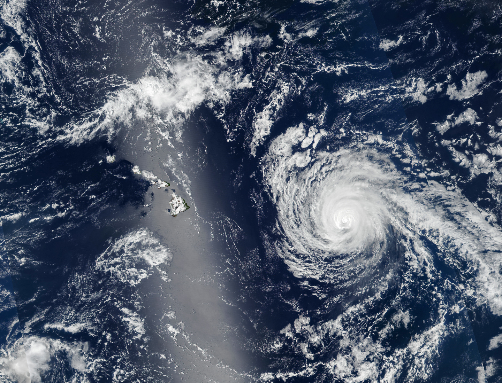
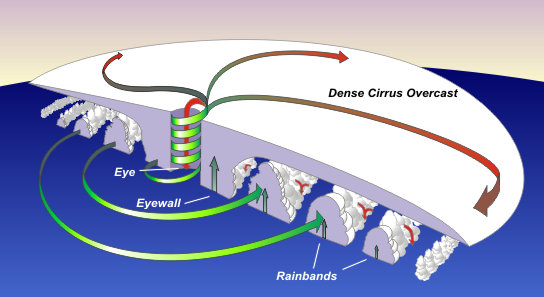

## Welcome & framing {.center}

**Hurricanes, Katrina & Health**  
_Ecosystems ↔ infrastructure ↔ people_

::: notes
Set the session arc: 
1) hurricane physics vs. impacts, 
2) Katrina as environmental justice case, 
3) health systems & preparedness, 
4) designing better risk communication than “category only”. 
:::

---

## What a hurricane is (and isn’t) {.image-right}

::: columns
:::{.column width="40%"}

Warm-core, low-pressure **tropical cyclones** with organized rotation  

:::{.fragment .fade-in}
:::{.callout title="Hurricane Hazards"}

:::{.fragment .fade-in}
Wind
:::
:::{.fragment .fade-in}
Storm surge 
:::
:::{.fragment .fade-in}
Rain 
:::
:::{.fragment .fade-in}
Tornadoes
:::
:::
:::

:::

:::{.column width="50%}

:::

:::

::: notes
Podcast: “warm core” due to latent heat release; strongest winds near surface. Frame risk as **Hazard × Exposure × Vulnerability**.
:::

---

## Weakening ≠ safe

A **weakening** hurricane can **expand** → bigger wind/surge footprint

::: notes
Public messaging risk: people anchor to the number, not the footprint. Previews Katrina dynamics at landfall.
:::

---

## Rapid Intensification (RI)

- More frequent near landfall  
- **Compressed decision windows** for evacuation & hospitals

::: notes
Prompt: If you run a coastal hospital, which actions move from T-48h to **T-72h** under higher RI risk? (Dialysis scheduling, O2 logistics, early discharges, staff lodging.)
:::

---

## {background-iframe="https://www.youtube.com/embed/xnSLlbKGB4U?rel=0" background-size="contain" background-position="center"}

## {background-iframe="https://www.youtube.com/embed/1iYM3BTuDDE?rel=0" background-size="contain" background-position="center"}

## Image: anatomy of a cyclone {.center}

{width="85%"}

::: notes
Narrate inflow/outflow, eyewall, rainbands, and where hazards concentrate relative to track.
:::

---

## Case study: Hurricane Katrina (2005)

:::{.callout title="What made this a particularly devestating disaster?"}

- Get into groups of 2-4 and create a list of the top 3 contributing factors.
  - Be prepared to explain the spatial/temporal and the social/economic context mediating each factor.
- Return to discuss as a group

:::

::: notes
Stress that many deaths were from **post-landfall flooding**, not peak winds. Infrastructure failure + social vulnerability → health catastrophe.
:::

---

## Katrina & environmental justice {.smaller}

{style="margin:0px" width="75%"}

::: {.callout title="How did the legacy of **redlining** contribute to the impacts?"}
Low-elevation, levee-adjacent neighborhoods, Car access & evacuation ability, Disproportionate impact in Lower Ninth/St. Bernard
:::

::: notes
Connect to previous class: how historical housing policy maps onto present-day disaster risk and **health inequities**.
:::

---

## Public health cascades

**Acute:** drowning, trauma, CO poisoning  
**Subacute:** waterborne disease, mold, asthma  
**Chronic:** PTSD/depression, DV rise, displacement

::: notes
Introduce **disaster epidemiology** terms (excess mortality, indirect deaths, syndemics). Ask: What surveillance would you deploy at 1 week / 1 month?
:::

---

## Evacuation paradox: Hurricane Rita (2005)

> Mass evacuation → **heat, dehydration, traffic** mortality

::: notes
Rita saw >2.5M evacuees; >50% of deaths occurred **during evacuation**. Discussion: When is **shelter-in-place** safer, and how do we message that?
:::

---

## Katrina lessons for today

- **Category ≠ consequence**  
- Community **capacity** drives mortality trajectory  
- **Mitigation** is equity-positive public health policy

::: notes
Bridge to ROI and planning: “Mitigation Saves” (~\$6 per \$1). Ask which two investments (grey/green or social) they’d prioritize **now** for NOLA.
:::

---

## Preparedness across scales

Household ↔ neighborhood ↔ clinic/hospital ↔ city

::: notes
We’ll ladder through: home kits & meds, neighbor check-ins, clinic surge, municipal transit/shelter ops. Assign a brief preparedness plan later.
:::

---

## Household & neighborhood

- Redundant alerts; meds & docs ready  
- Know your **floodplain** / drainage  
- Pets, caregivers, carpool networks, **mutual aid**

::: notes
Quick activity: sketch a neighbor **check-in grid** (names, needs, contact, “last seen”).
:::

---

## Clinics & hospitals

- Pre-position **oxygen/dialysis/insulin**; backup power  
- On-site staff lodging & childcare  
- Early discharges; **telehealth** triage  
- Post-storm: **heat, mold, vector** control

::: notes
Mini-scenario: A Cat 2 is forecast to **RI to Cat 4** in 24–36h. What activates at **T-36h**, **T-12h**, and **+48h**?
:::

---

## Community & policy levers

- Cool roofs, raised utilities, permeable streets  
- Surge barriers, wetland restoration, buyouts  
- **Transit-enabled** evacuation  
- Fund local EM; measure outcomes

::: notes
Highlight co-benefits (air quality, heat). Note who benefits first if budgets are tight; link to equity.
:::

---

## Video: policy or health case {background-iframe="https://www.youtube.com/embed/VIDEO_ID?rel=0"}

*(Paste a short YouTube explainer; adjust for autoplay per your policy.)*

::: notes
Prompt: list **three “no-regret” investments** with health benefits even absent a storm next year.
:::

---

## Designing better risk metrics

Beyond category: **surge**, **rainfall**, **footprint**, **RI risk**  
Exposure: **population, assets, hospitals**  
Vulnerability: **SVI**, car access, language, disability

::: notes
Group task (5–6 min): Propose a **4-component index** for your chosen coastal city. One team shares out.
:::

