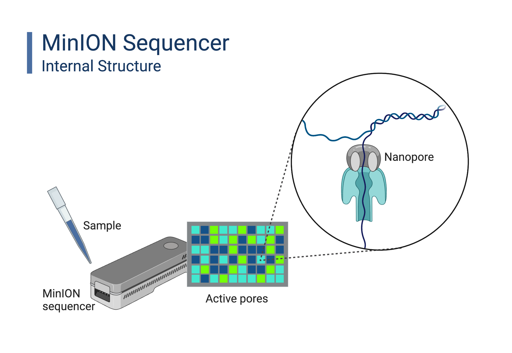
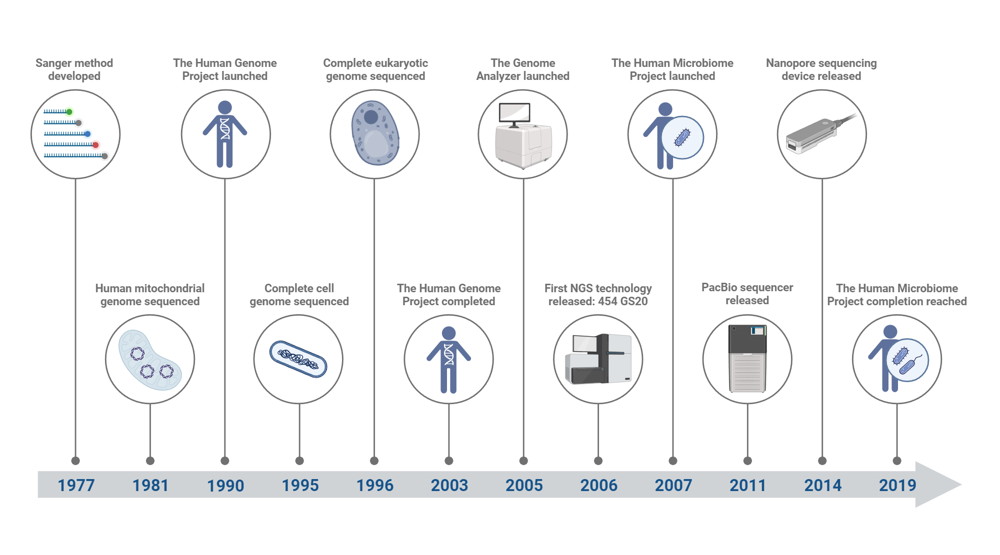
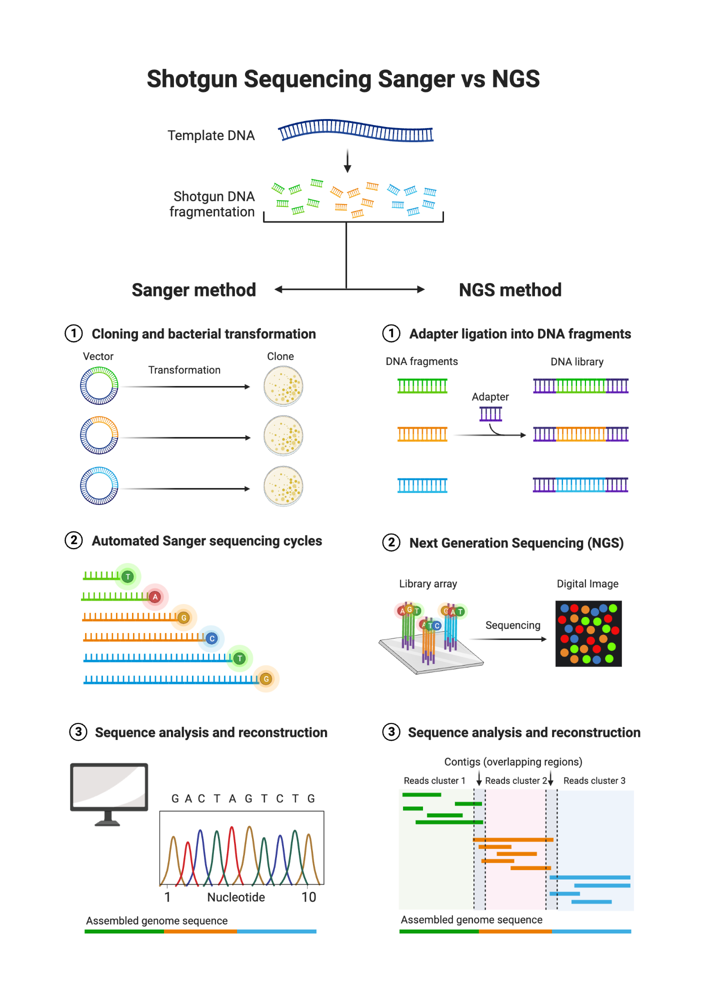
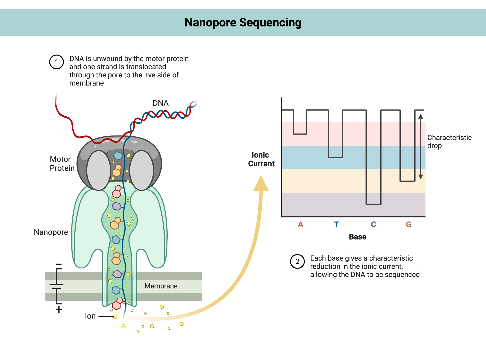
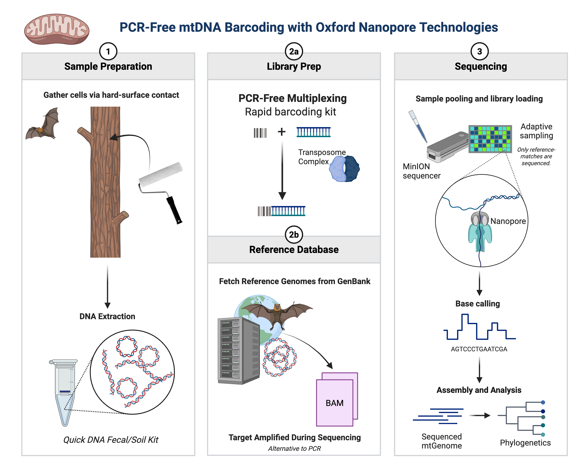
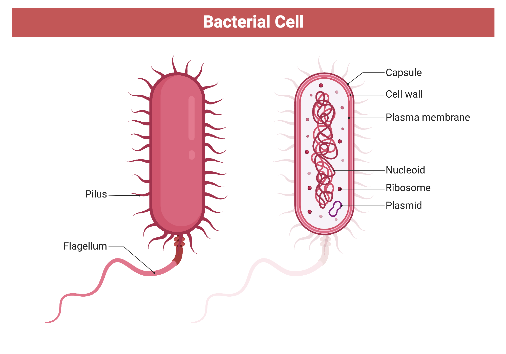
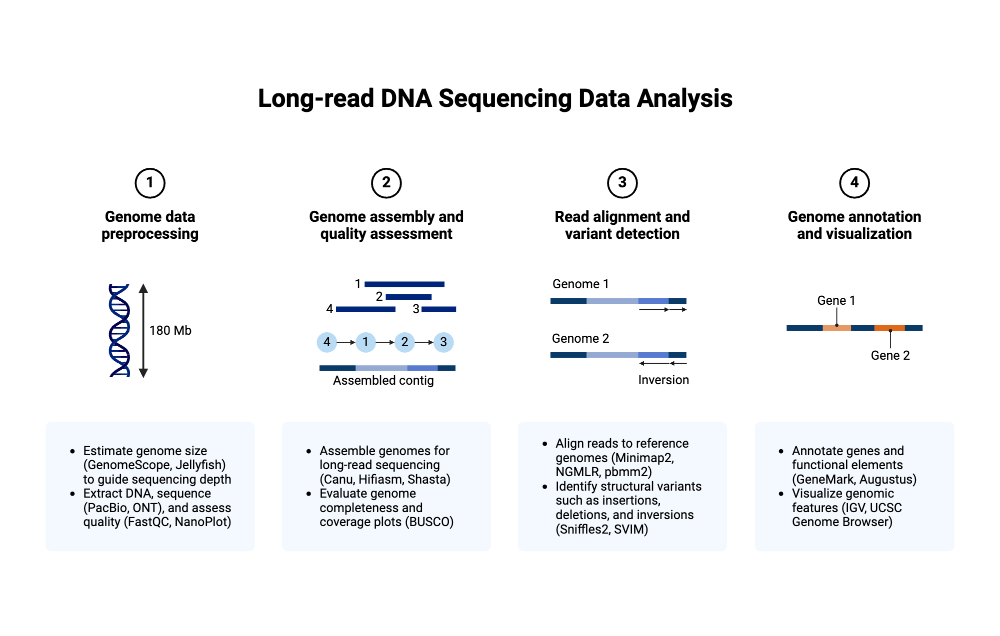
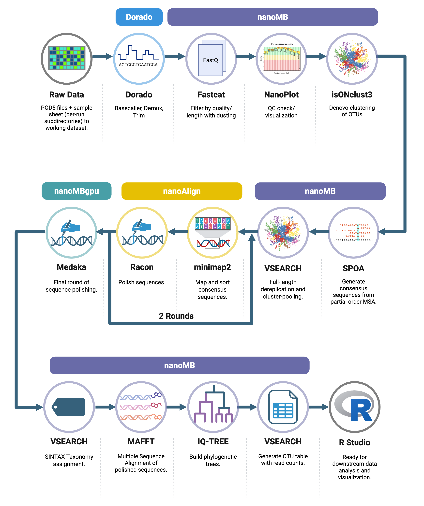

## {}

::: columns
::: {.column width="65%"}

:::{.box-opaque}

::: {.dateplace}
 - 
:::

::: {.title}

:::

:::

:::

:::

::: {.column}

{.image-right}

:::

##

##

{.image-center}

##

##

##

##

##

